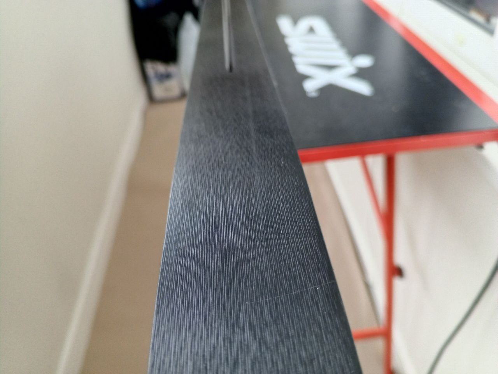
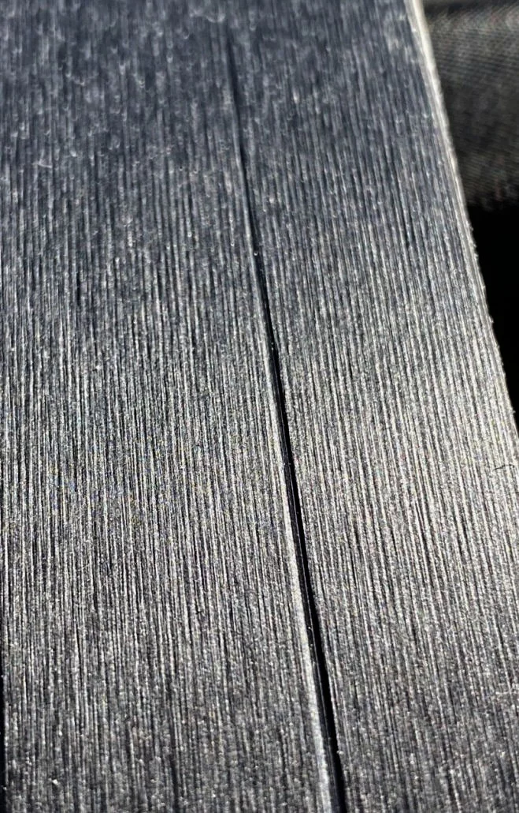
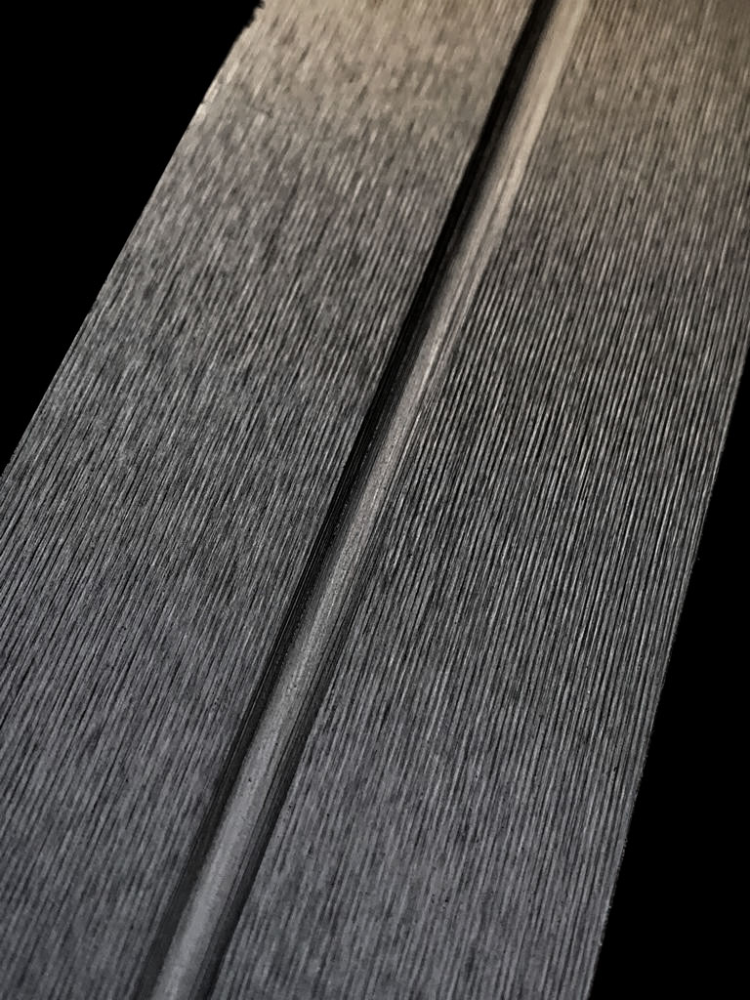
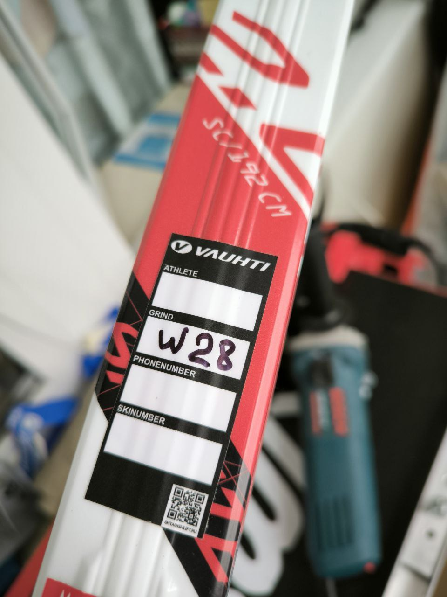
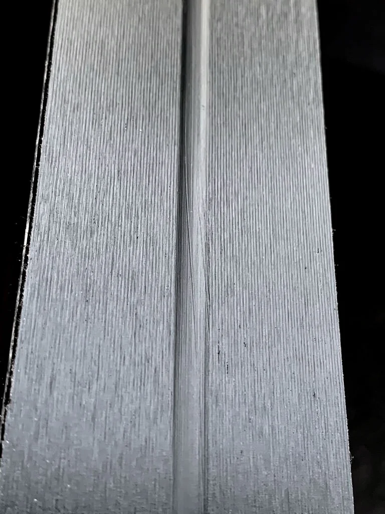
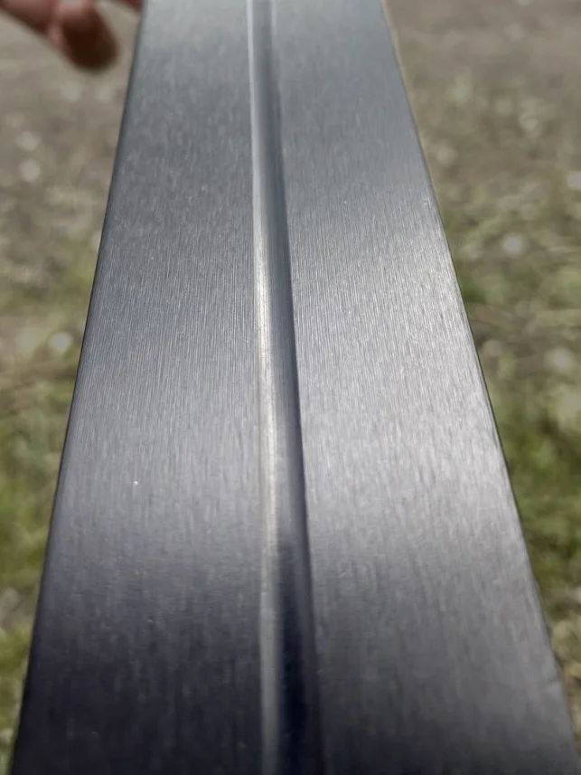

# ❄️ Awesome Steinschliff

Awesome Steinschliff — это живой каталог знаний о лыжных структурах (штайншлифах), собранный на основе реального опыта, инженерной логики и спортивного здравомыслия.
Мы объединяем разрозненные знания, таблицы, наблюдения и догадки в одну системную базу.

Здесь встречаются стандартные заводские структуры, авторские кастомы, тесты от смазчиков и региональные тонкости.
Всё, чтобы в ноябре не начинать с чистого листа!

## 📌 Миссия проекта

Awesome Steinschliff — это не просто таблица с штайншлифами.
Это попытка упорядочить хаос, заархивировать опыт поколений и построить единую базу знаний о том, как лыжи скользят по снегу.

Каждую осень мы начинаем с нуля: лихорадочно вспоминаем, что ехало в -12°C на переморожке, какая структура работала в фирне и почему «в тот день» всё было идеально.
Пора положить этому конец! =)

Проект создан, чтобы:

* 🔬 систематизировать опыт спортсменов, смазчиков, мастеров и инженеров по подготовке лыж
* 🧠 оцифровать и унифицировать информацию о штайншлифах: диапазоны, нюансы, региональные поправки
* 🎯 облегчить выбор структуры — на основе логики, а не догадок
* 🛠️ создать инструменты — таблицы, Telegram-бот, визуализации и экспорт в PDF/HTML, чтобы знания работали, а не пылились

## 🧠 Что такое структура (штайншлифт) и зачем она нужна?

Структура — это микрорельеф на скользящей поверхности лыжи, аналогичный протектору шины. Она служит для оптимизации взаимодействия лыжи со снегом в зависимости от температуры, влажности и типа снежного покрытия.

Главная цель структуры — минимизация сопротивления скольжению, возникающего за счёт:

* **Сухого (механического) трения** — контакт между микронеровностями лыжи и снежными кристаллами.
* **Вязкого сопротивления** — торможения при наличии водяной плёнки.
* **Влияния электростатических сил** — дополнительного эффекта при сухом и морозном снеге.

### Как работает структура в разных условиях

* **Холодный, сухой снег (< –15°C):**
  Уменьшает площадь контакта, минимизирует микродеформации и помогает снизить влияние электростатических зарядов.

* **Умеренные условия (–15°C … 0°C):**
  Стабилизирует водяную плёнку, снижает вязкое сопротивление и обеспечивает сбалансированное трение.

* **Тёплый, влажный снег (> 0°C):**
  Агрессивные каналы отводят воду, предотвращая аквапланирование и молекулярное прилипание.

> 📌 Выбор структуры зависит не только от температуры, но и от влажности, типа снега (естественный, искусственный, трансформированный), давления и длины дистанции.

---

## 🧪 Взаимодействие лыжи и снега: типы сопротивления и роль структуры

Скольжение — это сложный термомеханический процесс. Правильный подбор структуры позволяет управлять различными формами сопротивления:

### 🔧 Основные типы сопротивления

1. **Сухое (механическое) трение**
   * Возникает при прямом контакте лыжи со снежными кристаллами.
   * Доминирует при низких температурах и жёстком, сухом снегу.
   * Минимизируется подбором структуры с гладким рельефом и использованием парафинов с твёрдой основой.

2. **Вязкое сопротивление**
   * Проявляется при наличии водяной плёнки (около 0°C и выше).
   * Затрудняет скольжение за счёт увеличения молекулярного притяжения.
   * Уменьшается с помощью глубоких, дренажных структур, эффективно отводящих влагу.

3. **Влияние электростатических сил**
   * При экстремально низких температурах (< –15°C) возможна генерация заряда на сухих поверхностях.
   * Это может усиливать трение за счёт электростатического притяжения между лыжей и снегом.
   * Снижается с помощью антистатических добавок и максимально гладких структур.

---

## 🧬 Зависимость трения от температуры и структура под каждый диапазон

| Температура снега | Доминирующее сопротивление         | Рекомендации по структуре                              |
|-------------------|------------------------------------|--------------------------------------------------------|
| < –15°C          | Твердое трение + электростатические силы | Гладкие структуры, антистатики в парафинах             |
| –15°C … –5°C    | Твердое (механическое) трение      | Универсальные структуры малой глубины                  |
| –5°C … 0°C      | Смешанное                          | Среднеагрессивные структуры                            |
| > 0°C            | Вязкое сопротивление               | Глубокие, продольные водоотводящие структуры           |

## Обсуждение проекта

* [тема форума на скиспорте](https://www.skisport.ru/forum/cross-country/104594)
* [чат в Telegram](https://t.me/+wddxUugE0gwxMGU6)

## Полезные видео и статьи

* [Сегей Лопухин в Эстонии](https://vkvideo.ru/video-220482174_456239484)
* [Заводской штайншлифт Salomon Atomic в ЭКИПИОН!](https://www.youtube.com/watch?v=txEHphQSFjk)
* [Процесс шлифования на сервисе Vuerich Service](https://youtu.be/YPfnXsF2QJg?si=CDNXJfvW0YkthP9a)
* [Обзор редких структур Рамзау](https://vkvideo.ru/video-220482174_456239484)
* [Обзор штайншлифта в ЭкипТайме](https://www.youtube.com/watch?v=IN1FKSIZT2I)
* [Статья про штайншлифт и структуры](https://training365.ru/shtajnshlift-i-struktury/)
## Оглавление

### Россия

* [Ekiptime (Москва)](#ekiptime-москва)
* [Marsport (Одинцово)](#marsport-одинцово)
* [Mass sport (Санкт-Петербург)](#mass-sport-санкт-петербург)
* [Serviccer (Красногорск)](#serviccer-красногорск)
* [Skipole (Москва)](#skipole-москва)
* [Svecky (Новосибирск)](#svecky-новосибирск)
* [Uventa (Москва)](#uventa-москва)

### Austria

* [Atomic](#atomic)
* [Beme](#beme)
* [Fischer](#fischer)
* [Fischer26](#fischer26)
* [Salomon](#salomon)

### France

* [Rossignol](#rossignol)

### Germany

* [Ramsau](#ramsau)

### Norway

* [Madshus](#madshus)

## Структуры

## Ekiptime (Москва)

Структуры для беговых лыж от компании Ekiptime

Сайт: [Ekiptime](https://ekiptime.ru/services/base_tuning.php)

Адрес: Москва, стадион Динамо, ВТБ Арена Плаза, Ленинградский проспект, 36

Обзор: [Ekiptime](https://www.youtube.com/watch?v=IN1FKSIZT2I)
### Контактная информация

* Телефоны:
  - +74997043525

| Название | Описание | Тип снега | Температура | Изображение | Теги | Похожие структуры | Особенности |
|------|------------|-----------|----------------|------|------|-------------------|-------------------|
| [SIGMA](schliffs/ekiptime/SIGMA.yaml) | структура для трансформированного старого весеннего снега с водой | wet, old, dirty, transformed | +15 °C … 0 °C |  | мокрый, старый, грязный, трансформированный, весенний |  |  |
| [UGOL13](schliffs/ekiptime/UGOL13.yaml) | структура для воды +2/+15 | watery, water | +15 °C … +2 °C |  | вода, мокрый, горячий |  |  |
| [AW22](schliffs/ekiptime/AW22.yaml) | структура для влажности 100%, 0/+15 | extreme_humidity, wet | +15 °C … 0 °C |  | экстремальная влажность, мокрый | [AW2](schliffs/ekiptime/AW2.yaml) |  |
| [AW8](schliffs/ekiptime/AW8.yaml) | весенняя структура на -5/+10 | spring, wet | +10 °C … –5 °C |  | весенний, теплый |  |  |
| [UGOL1](schliffs/ekiptime/UGOL1.yaml) | тёплая структура 0/+5 | warm, wet | +5 °C … 0 °C |  | теплый, мокрый | [UGOL13](schliffs/ekiptime/UGOL13.yaml) |  |
| [AW7](schliffs/ekiptime/AW7.yaml) | структура для крупнозернистого, падающего мокрого снега при -5/+5, хорошо работает поздней весной в России, на водянистый снег дополняется накаткой | coarse, wet, falling, spring | +5 °C … –5 °C |  | крупнозернистый, мокрый, падающий, весенний, Russia |  | накатка для водянистого снега |
| [AW2](schliffs/ekiptime/AW2.yaml) | структура на высокую влажность и водянистый снег | wet, watery, high_humidity | +2 °C … –2 °C |  | влажный, водянистый, высокая влажность |  |  |
| [AM6](schliffs/ekiptime/AM6.yaml) | структура на +1/-8, подходит на все типы снега, отлично работает на крупнозернистом снегу после оттепели | all, coarse, thawed | +1 °C … –8 °C |  | универсальный, крупнозернистый, оттепель |  |  |
| [AW4](schliffs/ekiptime/AW4.yaml) | структура для крупнозернистого снега при 0/-2, хорошо работает поздней весной в России, дополняется ручной накаткой | coarse, spring | 0 °C … –2 °C |  | крупнозернистый, весенний, Russia, накатка |  | ручная накатка |
| [SV77](schliffs/ekiptime/sv77.yaml) | универсальная структура на средний холод и низкой влажности при температуре от -0 до -20 | cold, dry, old, fresh | 0 °C … –20 °C |  | холодный, сухой, свежий, старый |  |  |
| [AW1](schliffs/ekiptime/AW1.yaml) | структура для влажного и мокрого снега на 0/-4 | wet, damp | 0 °C … –4 °C |  | влажный, мокрый |  |  |
| [AM7-2](schliffs/ekiptime/AM7-2.yaml) | структура для большой влажности, свеже выпавшего снега 0/-6 | fresh, high_humidity | 0 °C … –6 °C |  | свежий, высокая влажность | [AM7](schliffs/ekiptime/AM7.yaml) |  |
| [AM2](schliffs/ekiptime/AM2.yaml) | структура для свежего, влажного или подмороженного снега при -1/-8 | fresh, wet, frozen | –1 °C … –8 °C |  | свежий, влажный, подмороженный |  |  |
| [AM3](schliffs/ekiptime/AM3.yaml) | структура для всех типов натурального и искусственного снега -2/-10 | all, natural, artificial | –2 °C … –10 °C |  | натуральный, искусственный |  |  |
| [AM7](schliffs/ekiptime/AM7.yaml) | универсальная структура на -4/-12, хорошо работает на свежем холодном снегу, подходит для большинства регионов России | all, fresh, cold | –4 °C … –12 °C |  | универсальный, свежий, холодный, Russia |  |  |
| [AM26](schliffs/ekiptime/AM26.yaml) | структура для большой влажности, натурального снега -5/-12 | natural, high_humidity | –5 °C … –12 °C |  | натуральный, высокая влажность |  |  |
| [AC4](schliffs/ekiptime/AC4.yaml) | структура для всех типов снега на -5 и ниже | all, cold | –5 °C … –20 °C |  | холодный, универсальный |  |  |
| [G1](schliffs/ekiptime/G1.yaml) | реплика структуры для экстремально холодного снега -5/-30 | cold, extremely_cold, dry | –5 °C … –30 °C |  | холодный, экстремально холодный, сухой, реплика |  |  |
| [AC5](schliffs/ekiptime/AC5.yaml) | структура для всех типов снега от -8 и холоднее, подходит для регионов России | all, cold | –8 °C … –25 °C |  | холодный, универсальный, Russia |  |  |
| [AC3](schliffs/ekiptime/AC3.yaml) | скандинавская холодная структура | cold, old, scandinavian | –8 °C … –17 °C |  | холодный, скандинавский |  |  |

## Marsport (Одинцово)

Кастомные структуры для беговых лыж от компании Марспорт

Сайт: [Marsport](https://marsport.ru/service)

Адрес: г. Одинцово ул. Манжосовская 1

### Контактная информация

* Телефоны:
  - +79250464773

| Название | Описание | Тип снега | Температура | Изображение | Теги | Похожие структуры | Особенности |
|------|------------|-----------|----------------|------|------|-------------------|-------------------|
| [F1](schliffs/marsport/F1.yaml) | стуктура для весеннего влажного снега | wet, old, dirty | +5 °C … –5 °C |  | влажный, старый, грязный | [S13-5](schliffs/ramsau/S13-5.yaml) |  |
| [M100](schliffs/marsport/M100.yaml) | структура для высокой влажности и свежего снега, подходит под глянец, температура от 0 до -10 | fresh | 0 °C … –10 °C |  | свежий снег, высокая влажность, глянец | [P5-1](schliffs/fischer/P5-1.yaml), [S12-16](schliffs/ramsau/S12-16.yaml), [B2211](schliffs/beme/B2211.yaml), [SV77](schliffs/ekiptime/sv77.yaml), [X25](schliffs/skipole/X25.yaml) |  |
| [SM15-5](schliffs/marsport/SM15-5.yaml) | универсальная структура для среднего холода и низкой влажности при температуре от -15 до -5 | fresh, transformed | –5 °C … –15 °C |  | свежий снег, средний холод | [S12-4](schliffs/ramsau/S12-4.yaml), [B227](schliffs/beme/B227.yaml) |  |
| [C100](schliffs/marsport/C100.yaml) | мелкая холодная структура на мороз | frozen, fresh | –10 °C … –25 °C |  | перемороженный, холодный | [S11-3](schliffs/ramsau/S11-3.yaml), [B227](schliffs/beme/B227.yaml), [G1](schliffs/salomon/G1.yaml), [X20](schliffs/skipole/X20.yaml) |  |

## Mass Sport (Санкт-Петербург)

Сервис штайншлифта на станке Svekom Ski World Cup Evo (совместно с YTC Ski Service). Приём лыж в УТЦ «Кавголово» по записи и в центрах MASS SPORT.

Сайт: [Mass Sport](https://www.skisport.ru/news/cross-country/119865/)

Адрес: УТЦ «Кавголово» — по предварительной записи (пос. Токсово, ул. Лесгафта 35/2).
Пункты приёма MASS SPORT: ТК «Вояж» (пр. Энгельса, 124/1, 5 вход, 3 этаж) и «Охта Парк» (дер. Мистолово, ул. Людмилы Кедриной).

### Контактная информация

* Телефоны:
  - +7 (911) 956-93-80
  - +7 (963) 329-00-24

| Название | Описание | Тип снега | Температура | Изображение | Теги | Похожие структуры | Особенности |
|------|------------|-----------|----------------|------|------|-------------------|-------------------|
| [T1.3](schliffs/mass%20sport/T1.3.yaml) | Для мокрого трансформированного снега 0..+10°C | transformed, wet | +10 °C … 0 °C |  | мокрый снег, трансформированный снег, тепло |  |  |
| [Fit-4](schliffs/mass%20sport/Fit-4.yaml) | Структура для 0..+8°C для всех типов снега, кроме падающего, средняя и высокая влажность | natural, artificial, transformed | +8 °C … 0 °C |  | тепло, средняя влажность, высокая влажность |  |  |
| [T20-10](schliffs/mass%20sport/T20-10.yaml) | Для свежего снега около 0°C, высокая влажность | fresh, natural, artificial | +3 °C … –3 °C |  | свежий снег, высокая влажность, около нуля |  |  |
| [T1.3fa](schliffs/mass%20sport/T1.3fa.yaml) | Для старого трансформированного снега около 0°C, средняя и высокая влажность | transformed | +3 °C … –3 °C |  | трансформированный снег, около нуля, средняя влажность, высокая влажность |  |  |
| [Fit-10](schliffs/mass%20sport/Fit-10.yaml) | Универсальная холодная структура для натурального и искусственного снега, высокая влажность | natural, artificial, all | –3 °C … –15 °C |  | универсальный, высокая влажность, холодный |  |  |
| [-15T1](schliffs/mass%20sport/-15T1.yaml) | Для свежего и старого перемороженного снега, очень холодно | fresh, old, refrozen, natural, artificial | –10 °C … –25 °C |  | перемороженный снег, очень холодно |  |  |

## Serviccer (Красногорск)

Структуры для беговых лыж от лыжного сервиса SERVICCER

Сайт: [Serviccer](https://serviccer.ru/strukturyi.html)

Адрес: МО, г.Красногорск, ул.Речная д.37 за зданием спортивной школы Waх-кабина "SERVICCER"

### Контактная информация

* Email: <servicerski@yandex.ru>
* Телефоны:
  - +79104316887
  - +79779055104

| Название | Описание | Тип снега | Температура | Изображение | Теги | Похожие структуры | Особенности |
|------|------------|-----------|----------------|------|------|-------------------|-------------------|
| [SR12-3](schliffs/serviccer/SR12-3.yaml) | тёплый весенний старый снег, вода; от +3 и выше | trancformed, wet, water | +10 °C … +3 °C |  | весенний снег, вода, тепло |  |  |
| [SV150](schliffs/serviccer/SV150.yaml) | на тепло +3…+5, весенний снег | spring | +5 °C … +3 °C |  | тепло, весенний снег |  |  |
| [W1](schliffs/serviccer/W1.yaml) | только на классику, переход 0→+, крупное зерно, глянец | classic, coarse, glossy | +3 °C … 0 °C |  | классика, крупное зерно, глянец |  |  |
| [SV100](schliffs/serviccer/SV100.yaml) | стурктура для глянца, старого и свежего снег, замыленный снега и температуры от +3 до -3 | fresh, old, glossy | +3 °C … –3 °C |  | глянец, замыленный |  | не едет в воду |
| [SR15](schliffs/serviccer/SR15.yaml) | +3…−3, трансформированный снег (фирн) | trancformed | +3 °C … –3 °C |  | фирн, трансформированный |  |  |
| [G2-2](schliffs/serviccer/G2-2.yaml) | +2…−5, любой тип снега, глянец | all, glossy | +2 °C … –5 °C |  | глянец |  |  |
| [R10-3](schliffs/serviccer/R10-3.yaml) | универсальная структура 0…-5 для свежего снега и глянца; TOP | fresh, glossy | 0 °C … –5 °C |  | универсальный, глянец, TOP |  |  |
| [G3.1](schliffs/serviccer/G3.1.yaml) | универсальная 0…−5, свежий снег | fresh | 0 °C … –5 °C |  | универсальный, свежий снег |  |  |
| [SV600](schliffs/serviccer/SV600.yaml) | универсальная структура −2…−10 на любой тип снега; TOP | all | –2 °C … –10 °C |  | универсальный, TOP |  |  |
| [V7-3](schliffs/serviccer/V7-3.yaml) | −2…−15, старый снег, хорошо подготовленная трасса | trancformed, fine_grained | –2 °C … –15 °C |  | старый снег, подготовленная трасса |  |  |
| [77](schliffs/serviccer/77.yaml) | −5…−18, холодный шлифт под любой тип снега | all | –5 °C … –18 °C |  | холод |  |  |
| [SR21](schliffs/serviccer/SR21.yaml) | −5…−15, любой тип снега | all | –5 °C … –15 °C |  | универсальный |  |  |
| [R11-2](schliffs/serviccer/R11-2.yaml) | −8…−18, любой тип снега, свежий снег | all, fresh | –8 °C … –18 °C |  | холод, свежий снег |  |  |
| [SV700](schliffs/serviccer/SV700.yaml) | на холод −8…−25, любой тип снега, перемороженный снег | all, frozen | –8 °C … –25 °C |  | холод, перемороженный |  |  |
| [R10](schliffs/serviccer/R10.yaml) | −10…−20, любой тип снега | all | –10 °C … –20 °C |  | холод |  |  |
| [SR23](schliffs/serviccer/SR23.yaml) | от −20 к −10 (когда днём отпускает мороз), свежий снег | fresh | –10 °C … –20 °C |  | свежий снег, холод |  |  |

## Skipole (Москва)

Кастомные структуры от Федора Николаева

Сайт: [Skipole](https://shtainshlift.ru)

Адрес: Москва, село Ромашково, ул.Советская, д.113

### Контактная информация

* Telegram: [Nikfedval](https://t.me/Nikfedval)
* Телефоны:
  - +79261489013
  - +79032181881

| Название | Описание | Тип снега | Температура | Изображение | Теги | Похожие структуры | Особенности |
|------|------------|-----------|----------------|------|------|-------------------|-------------------|
| [X20](schliffs/skipole/X20.yaml) | структура для свежего и старого снега при температуре от -5 до 15 | all, fresh, old | +15 °C … –5 °C |  | свежий снег |  | При потеплении едет хуже, чем на свежем или падающем снегу. В регионах с низкой влажностью — почти не применяется в начале сезона. Во второй половине — сдвиг на +5–7°C. |
| [W30](schliffs/skipole/W30.yaml) | стуктура для мокрого снега с дождём | wet, rain | +10 °C … 0 °C |  | мокрый снег, дождь |  |  |
| [W28](schliffs/skipole/W28.yaml) | переходная структура на любой тип снега при температуре от +3 до -3 | all | +3 °C … –3 °C |  | переходная | [SV100](schliffs/serviccer/SV100.yaml), [F1](schliffs/marsport/F1.yaml) | Может ехать лучше ожидаемого, если снег уже сильно трансформирован. |
| [X25](schliffs/skipole/X25.yaml) | стуктура для свежего и нового натурального снега, глянец при температуре от 0 до -8 | all | 0 °C … –8 °C |  | свежий снег, глянец | [S12-6](schliffs/ramsau/S12-6.yaml), [B2211](schliffs/beme/B2211.yaml), [SV100](schliffs/serviccer/SV100.yaml) |  |
| [X0](schliffs/skipole/X0.yaml) | структура для натурального сухого снега при температуре ниже -12 | frozen, dry, natural | –12 °C … –25 °C |  | сухой снег, натуральный снег |  |  |

## Svecky (Новосибирск)

Cервис оказывает услуги по нанесению штайншлифа на беговые лыжи используя машину [Delta](https://www.svecomski.com/en/products/machines/delta-research-160-2) от фирмы [SVECOM SKI](http://www.svecomski.com).

Сайт: [Svecky](http://svecky.racing/)

Адрес: Новосибирск, Академгородок, ул. Ионосферная 3

### Контактная информация

* Telegram: [svecky](https://t.me/svecky)
* Телефоны:
  - +7(913)478-29-59
  - +7(913)000-04-00

| Название | Описание | Тип снега | Температура | Изображение | Теги | Похожие структуры | Особенности |
|------|------------|-----------|----------------|------|------|-------------------|-------------------|
| [16-4](schliffs/svecky/16-4.yaml) | Универсальная тёплая структура в том числе на очень влажные условия | all, wet | +10 °C … –1 °C |  | универсальная, тёплая, влажные условия |  |  |
| [TP50](schliffs/svecky/TP50.yaml) | Для мокрых кондиций, хорошо проявила себе под проливным дождем | wet, rain | +10 °C … 0 °C |  | дождь, мокрый снег, влажные условия |  |  |
| [LiB](schliffs/svecky/LiB.yaml) | Тёплая структура на свежий снег, высокая влажность | fresh, new | +5 °C … –4 °C |  | тёплая, свежий снег, высокая влажность |  |  |
| [P51-33](schliffs/svecky/P51-33.yaml) | Универсальная структура | all, transformed, old | +2 °C … –9 °C |  | универсальная, трансформированный снег |  | Не подходит для мелкого свежего снега |
| [VT322](schliffs/svecky/VT322.yaml) | Структура для классики на мелкозернистый и свежий снег | fine, fresh | 0 °C … –16 °C |  | классический стиль, мелкозернистый снег, свежий снег |  | cпециально для классического стиля |
| [VT3-2](schliffs/svecky/VT3-2.yaml) | Структура на свежий снег при холодных температурах | fresh, new | –3 °C … –12 °C |  | свежий снег, холодная |  |  |
| [VT1.3](schliffs/svecky/VT1.3.yaml) | Холодная структура, хорошо работает в раскат | used, transformed | –4 °C … –16 °C |  | холодная, трансформированный снег |  |  |
| [PRG](schliffs/svecky/PRG.yaml) | Структура на трансформированный, ратрачный снег на средне-холодные температуры | transformed, groomed | –5 °C … –13 °C |  | трансформированный снег, ратрачный снег, холодная |  | Для хорошо подготовленных трасс |

## Uventa (Москва)

Кастомные структуры для беговых лыж от сервисного центра Ювента Спорт

Сайт: [Uventa](https://www.uventasport.ru/company/servis-centr/shtaynshlift/)

Адрес: Москва

| Название | Описание | Тип снега | Температура | Изображение | Теги | Похожие структуры | Особенности |
|------|------------|-----------|----------------|------|------|-------------------|-------------------|
| [X3LS](schliffs/uventa/X3LS.yaml) | На влажный старый, преобразованный и грязный снег, температурный диапазон от +10°C до -2°C | wet, old, transformed, dirty | +10 °C … –2 °C |  | влажный снег, старый снег, преобразованный снег, грязный снег | [Z1](schliffs/uventa/Z1.yaml) |  |
| [N33](schliffs/uventa/N33.yaml) | Переходная структура для любого типа снега, температурный диапазон от +5°C до -5°C | all | +5 °C … –5 °C |  | переходная, универсальная, любой снег | [X1W](schliffs/uventa/X1W.yaml), [729](schliffs/uventa/729.yaml) |  |
| [729](schliffs/uventa/729.yaml) | Универсальная структура для свежего и старого снега, температурный диапазон от +2°C до -12°C | fresh, old, universal | +2 °C … –12 °C |  | универсальная, свежий снег, старый снег | [N33](schliffs/uventa/N33.yaml) |  |
| [X1W](schliffs/uventa/X1W.yaml) | Переходная структура для любого типа снега, температурный диапазон от +2°C до -2°C | all | +2 °C … –2 °C |  | переходная, универсальная, любой снег | [N33](schliffs/uventa/N33.yaml) |  |
| [Z1](schliffs/uventa/Z1.yaml) | Для глянца, жесткой трассы и сильно преобразованного снега, температурный диапазон от 0°C до -5°C | transformed, hard, glazed | 0 °C … –5 °C |  | глянец, жесткая трасса, преобразованный снег | [X3LS](schliffs/uventa/X3LS.yaml) |  |
| [SL7](schliffs/uventa/SL7.yaml) | Для свежего и слабо преобразованного снега, температурный диапазон от -3°C до -10°C | fresh, slightly_transformed | –3 °C … –10 °C |  | свежий снег, слабо преобразованный снег | [729](schliffs/uventa/729.yaml) |  |
| [330](schliffs/uventa/330.yaml) | Холодная структура для утрамбованного, преобразованного и жесткого снега, температурный диапазон от -5°C до -20°C | frozen, cold, transformed | –5 °C … –20 °C |  | холодная, утрамбованный снег, преобразованный снег, жесткий снег | [C110X](schliffs/uventa/C110X.yaml) |  |
| [C110X](schliffs/uventa/C110X.yaml) | Холодная структура для нового и преобразованного снега, температурный диапазон от -10°C до -20°C | fresh, transformed | –10 °C … –20 °C |  | холодная, новый снег, преобразованный снег | [330](schliffs/uventa/330.yaml) |  |

## Atomic

Стандартные структуры для беговых лыж от компании Atomic

Сайт: [Atomic](https://www.atomic.com)

| Название | Описание | Тип снега | Температура | Изображение | Теги | Похожие структуры | Особенности |
|------|------------|-----------|----------------|------|------|-------------------|-------------------|
| [AW7](schliffs/atomic/AW7.yaml) | структура на крупнозернистый, водянистый снег при −2 0. Подходит для конька и классики. Хорошо работает поздней весной в России. Atomic также рекомендует на −5 +5. | fine_grained, wet | +5 °C … –5 °C |  | крупнозернистый, водянистый, весна, конек, классика |  |  |
| [AW1](schliffs/atomic/AW1.yaml) | структура на влажный снег при 0 −4. Предназначена для классических лыж. | wet | 0 °C … –4 °C |  | влажный снег, классика |  |  |
| [AM2](schliffs/atomic/AM2.yaml) | под свежий снег, глянец и влажный снег на −5 −1. Нарезается на классику и конек. | fresh, wet | –1 °C … –5 °C |  | свежий снег, влажный, конек, классика |  |  |
| [AM6](schliffs/atomic/AM6.yaml) | хорошо работает на крупнозернистом снегу после оттепели в −8 −1. Подходит на конек и классику. | fine_grained, trancformed | –1 °C … –8 °C |  | крупнозернистый, конек, классика |  |  |
| [AM1](schliffs/atomic/AM1.yaml) | структура для смешанного искусственного и свежего снега на −10 −3. Подходит для классики и конька. | artificial, fresh | –3 °C … –10 °C |  | смешанный снег, конек, классика |  |  |
| [AM7](schliffs/atomic/AM7.yaml) | хорошо работает на сухом снеге в −10 −4. Подходит для конька и классики, иногда работает и холоднее. | frozen | –4 °C … –15 °C |  | сухой снег, конек, классика |  |  |
| [AC4](schliffs/atomic/AC4.yaml) | универсальная холодная структура на −15 −5. Подходит для конька и классики, особенно хороша при высокой влажности. | all | –5 °C … –15 °C |  | холодный, универсальный, высокая влажность, конек, классика |  |  |
| [AC5](schliffs/atomic/AC5.yaml) | очень холодная структура для всех типов снега на −20 −8. Хорошо работает в России. Atomic также рекомендует на −30 −8. | all | –8 °C … –30 °C |  | очень холодный, универсальный, конек, классика |  |  |
| [AC3](schliffs/atomic/AC3.yaml) | универсальная холодная структура на −17 −8. Хорошо работает в Скандинавии. Для классики и конька. | all | –8 °C … –17 °C |  | холодный, универсальный, конек, классика |  |  |

## Beme

Структуры для беговых лыж от Бенжамина Эдера, сервис Beme

Сайт: [Beme](https://www.bemesports.com/en/skiservice)

| Название | Описание | Тип снега | Температура | Изображение | Теги | Похожие структуры | Особенности |
|------|------------|-----------|----------------|------|------|-------------------|-------------------|
| [B3312](schliffs/beme/B3312.yaml) | струтура на переходку и тепло, на влажный, но не жидкий снег | wet, transformed | +5 °C … –5 °C |  | переходка, тепло, влажный | [S13-5](schliffs/ramsau/S13-5.yaml), [S13-4](schliffs/ramsau/S13-4.yaml) |  |
| [B2211](schliffs/beme/B2211.yaml) | универсальная структура на все типы снега, особенно на свеже выпавший снег | all, fresh | –1 °C … –12 °C |  | универсальная, свежий снег, все типы снега | [P5-1](schliffs/fischer/P5-1.yaml), [S12-16](schliffs/ramsau/S12-16.yaml) |  |
| [B227](schliffs/beme/B227.yaml) | стуктура для морозного снега и температуры ниже -5 | cold | –5 °C … –20 °C |  |  | [PL1](schliffs/ramsau/Pl1.yaml), [S11-3](schliffs/ramsau/S11-3.yaml) |  |

## Fischer

Стандартные структуры Fischer

Сайт: [Fischer](https://www.fischersports.com)

| Название | Описание | Тип снега | Температура | Изображение | Теги | Похожие структуры | Особенности |
|------|------------|-----------|----------------|------|------|-------------------|-------------------|
| [P3-3](schliffs/fischer/P3-3.yaml) | водянистый снег от +3 до +15 | watery, wet | +15 °C … +3 °C |  | водянистый снег, высокая температура |  |  |
| [P5-1](schliffs/fischer/P5-1.yaml) | универсальная структура для любого типа снега на температуру от +5 до -10 | all | +5 °C … –10 °C |  | универсальный, широкий диапазон |  | стандартная |
| [P22-6](schliffs/fischer/P22-6.yaml) | переходная структура на любой тип снега, температура от +5 до -5 | all | +5 °C … –5 °C |  | универсальный, переходная структура, широкий диапазон | [P5-1](schliffs/fischer/P5-1.yaml), [P11-2](schliffs/fischer/P11-2.yaml) | переходная структура |
| [P1-1](schliffs/fischer/P1-1.yaml) | структура для свежего снега при температуре +3 до -5 | fresh | +3 °C … –5 °C |  | свежий снег, умеренный | [P10-3](schliffs/fischer/P10-3.yaml), [S12-2](schliffs/ramsau/S12-2.yaml) |  |
| [P11-2](schliffs/fischer/P11-2.yaml) | все типы снега при температуре от +2 до -8 | all | +2 °C … –8 °C |  | универсальный, широкий диапазон | [P11-1](schliffs/fischer/P11-1.yaml), [P5-1](schliffs/fischer/P5-1.yaml), [P22-6](schliffs/fischer/P22-6.yaml) |  |
| [P10-3](schliffs/fischer/P10-3.yaml) | структура для падающего свежего снега, температура от 0 до -5 | fresh, falling | 0 °C … –5 °C |  | падающий снег, свежий, легкий мороз | [S12-6](schliffs/ramsau/S12-6.yaml), [P1-1](schliffs/fischer/P1-1.yaml) |  |
| [TZ1-1](schliffs/fischer/TZ1-1.yaml) | на свежий снег при температуре ниже 0 | fresh |  |  | свежий снег, минусовая температура | [P10-3](schliffs/fischer/P10-3.yaml), [S12-2](schliffs/ramsau/S12-2.yaml) |  |
| [P11-1](schliffs/fischer/P11-1.yaml) | чуть холоднее чем P11-2 | all | 0 °C … –10 °C |  | универсальный, средняя температура | [P11-2](schliffs/fischer/P11-2.yaml), [P5-1](schliffs/fischer/P5-1.yaml) | чуть холоднее чем P11-2 |
| [C8-1](schliffs/fischer/C8-1.yaml) | более узкая структура для искусственного снега от 0 до -10 | artificial | 0 °C … –10 °C |  | искусственный снег, узкая структура |  |  |
| [P5-0](schliffs/fischer/P5-0.yaml) | сухой мелкий снег от 0 до -5 | dry, old, fine | 0 °C … –5 °C |  | сухой, старый, мелкозернистый, мелкий снег | [S12-6](schliffs/ramsau/S12-6.yaml) |  |
| [P10-1](schliffs/fischer/P10-1.yaml) | для сухого снега при температуре ниже 0 | dry |  |  | сухой снег, минусовая температура | [S11-1](schliffs/ramsau/S11-1.yaml), [P5-0](schliffs/fischer/P5-0.yaml) |  |
| [C12-7](schliffs/fischer/C12-7.yaml) | мелкозернистый снег на температуре от 0 до -10 | fine_grained | 0 °C … –10 °C |  | мелкозернистый, средняя температура | [S13-5-08](schliffs/ramsau/S13-5-08.yaml) |  |
| [C12-1](schliffs/fischer/C12-1.yaml) | любой тип снега, температура от -15 до -5 | all | –5 °C … –15 °C |  | холодный, универсальный | [C1-1](schliffs/fischer/C1-1.yaml) |  |
| [C3-1](schliffs/fischer/C3-1.yaml) | для искусственного снега, температура ниже -5 | artificial | –25 °C … –5 °C |  | холодный, искусственный снег | [C8-1](schliffs/fischer/C8-1.yaml), [S12-7](schliffs/ramsau/S12-7.yaml) |  |
| [P5-9](schliffs/fischer/P5-9.yaml) | структура для классических лыж на старый мокрый снег, температура от 0 и выше | old, wet |  |  | классические лыжи, старый снег, мокрый | [P3-2](schliffs/fischer/P3-2.yaml), [P9-2](schliffs/fischer/P9-2.yaml) | классический стиль |
| [P3-2](schliffs/fischer/P3-2.yaml) | на старый мокрый снег при t 0 с переходом в плюс | old, wet |  |  | старый снег, мокрый, плюсовая температура | [P3-1](schliffs/fischer/P3-1.yaml), [P5-9](schliffs/fischer/P5-9.yaml) |  |
| [C1-1](schliffs/fischer/C1-1.yaml) | все типы снега, включая свежий, температура ниже -5 | all, fresh |  |  | холодный, универсальный | [C12-1](schliffs/fischer/C12-1.yaml) |  |
| [P9-2](schliffs/fischer/P9-2.yaml) | влажный снег, t выше 0 | wet |  |  | влажный снег, плюсовая температура | [P3-1](schliffs/fischer/P3-1.yaml), [S13-5](schliffs/ramsau/S13-5.yaml) |  |
| [P3-1](schliffs/fischer/P3-1.yaml) | структура на свежий влажный снег, на 0 градусов с переходом в плюсовую | fresh, wet |  |  | свежий снег, влажный, плюсовая температура | [P3-2](schliffs/fischer/P3-2.yaml), [S13-5](schliffs/ramsau/S13-5.yaml) |  |

## Fischer 2026

Линейка структур Fischer с 2026 года (переименованные)

| Название | Описание | Тип снега | Температура | Изображение | Теги | Похожие структуры | Особенности |
|------|------------|-----------|----------------|------|------|-------------------|-------------------|
| [F-359](schliffs/fischer26/F-359.yaml) | влажный мелкий липкий снег | wet, fine_grained | +5 °C … 0 °C |  | мокрый снег | TZ1-2 |  |
| [F-372](schliffs/fischer26/F-372.yaml) | крупнозернистый до мокрого снега | coarse, wet | +5 °C … 0 °C |  | мокрый снег, крупнозернистый | [P11-2](schliffs/fischer/P11-2.yaml) |  |
| [F-390](schliffs/fischer26/F-390.yaml) | мокрые условия (чаще для классики) | wet, classic | +5 °C … 0 °C |  | мокрый снег, классика | [P9-2](schliffs/fischer/P9-2.yaml) |  |
| [F-311](schliffs/fischer26/F-311.yaml) | крупнозернистый, перемороженный и трансформированный снег | coarse, frozen, trancformed | +5 °C … –5 °C |  | крупнозернистый, перемороженный | [P11-1](schliffs/fischer/P11-1.yaml) |  |
| [F-275](schliffs/fischer26/F-275.yaml) | Standard Plus | all | +5 °C … –10 °C |  | универсальный | [P5-1](schliffs/fischer/P5-1.yaml) |  |
| [F-395](schliffs/fischer26/F-395.yaml) | мокрый, липкий снег, дождь | wet, rain | +5 °C … 0 °C |  | мокрый снег, дождь | P14-1 |  |
| [F-205](schliffs/fischer26/F-205.yaml) | свежий снег | fresh | +3 °C … –5 °C |  | свежий снег | [P1-1](schliffs/fischer/P1-1.yaml) |  |
| [F-230](schliffs/fischer26/F-230.yaml) | универсальная при любых типах снега | all | +2 °C … –7 °C |  | универсальный | [P5-0](schliffs/fischer/P5-0.yaml) |  |
| [F-256](schliffs/fischer26/F-256.yaml) | искусственный мелкозернистый снег | artificial, fine_grained | +2 °C … –5 °C |  | искусственный снег | [P22-6](schliffs/fischer/P22-6.yaml) |  |
| [F-211](schliffs/fischer26/F-211.yaml) | мелкозернистый снег | fine_grained | +1 °C … –8 °C |  | мелкозернистый | P2-1 |  |
| [F-226](schliffs/fischer26/F-226.yaml) | зернистый снег и мокрый свежий снег | trancformed, wet, fresh | 0 °C … –7 °C |  | мокрый снег, свежий снег | [S12-6](schliffs/ramsau/S12-6.yaml), [P10-3](schliffs/fischer/P10-3.yaml) |  |
| [F-201](schliffs/fischer26/F-201.yaml) | мукообразный снег | fine_grained | 0 °C … –10 °C |  | универсальный | [P10-1](schliffs/fischer/P10-1.yaml) |  |
| [F-198](schliffs/fischer26/F-198.yaml) | универсальная | all | 0 °C … –10 °C |  | универсальный | [TZ1-1](schliffs/fischer/TZ1-1.yaml) |  |
| [F-138](schliffs/fischer26/F-138.yaml) | универсальная холодная | all | –5 °C … –15 °C |  | холодный, универсальный | [C8-1](schliffs/fischer/C8-1.yaml) |  |
| [F-110](schliffs/fischer26/F-110.yaml) | холодный мелкозернистый (свежий) снег | fresh, fine_grained | –5 °C … –13 °C |  | холодный, свежий снег | [C3-1](schliffs/fischer/C3-1.yaml) |  |
| [F-171](schliffs/fischer26/F-171.yaml) | холодный искусственный снег | artificial | –7 °C … –30 °C |  | искусственный снег, холодный | [C12-1](schliffs/fischer/C12-1.yaml) |  |
| [F-115](schliffs/fischer26/F-115.yaml) | для очень холодных условий | all | –10 °C … –30 °C |  | экстремальный холод | [C1-1](schliffs/fischer/C1-1.yaml) |  |

## Salomon

Стандартные структуры для беговых лыж от компании Salomon

Сайт: [Salomon](https://www.salomon.com)

| Название | Описание | Тип снега | Температура | Изображение | Теги | Похожие структуры | Особенности |
|------|------------|-----------|----------------|------|------|-------------------|-------------------|
| [SL32](schliffs/salomon/SL32.yaml) | структура для влажного и очень мокрого старого снега, а также для грязного снега при средней и мягкой жесткости трассы | wet, transformed, dirty | +15 °C … 0 °C |  | влажный, мокрый, грязный, старый | [S13-5](schliffs/ramsau/S13-5.yaml), [S13-4](schliffs/ramsau/S13-4.yaml) |  |
| [SLRGL](schliffs/salomon/SLRGL.yaml) | структура на переменную от холода на тепло и на жесткую трассу и искусственный снег | natural, artificial, wet | +5 °C … –3 °C |  | влажный, мокрый, грязный, старый, искусственный | [S13-5](schliffs/ramsau/S13-5.yaml), [S13-4](schliffs/ramsau/S13-4.yaml), [B3312](schliffs/beme/B3312.yaml), [SV100](schliffs/serviccer/SV100.yaml) |  |
| [SL21](schliffs/salomon/SL21.yaml) | стандартная структура для жестких трасс, натуральный и искусственный снег, температура от +1 до -7 | natural, artificial | +1 °C … –7 °C |  | натуральный, искусственный, смешеный | [S12-16](schliffs/ramsau/S12-16.yaml), [S12-6](schliffs/ramsau/S12-6.yaml), [B2211](schliffs/beme/B2211.yaml), [SV600](schliffs/serviccer/SV600.yaml), [M100](schliffs/marsport/M100.yaml) |  |
| [SL22](schliffs/salomon/SL22.yaml) | стандартная структура для жестких трасс, натуральный и искусственный снег, температура от +1 до -7 | natural, artificial | +1 °C … –7 °C |  | натуральный, искусственный, смешеный | [S12-16](schliffs/ramsau/S12-16.yaml), [S12-6](schliffs/ramsau/S12-6.yaml), [B2211](schliffs/beme/B2211.yaml), [SV600](schliffs/serviccer/SV600.yaml), [M100](schliffs/marsport/M100.yaml) |  |
| [G1](schliffs/salomon/G1.yaml) | натуральный холодный снег на температуру -5 и холоднее | natural, cold, dry | –5 °C … –20 °C |  | сухой, холодный, натуральный | C12-4 |  |
| [SL1](schliffs/salomon/SL1.yaml) | структура для натурального холодного и сухого снега, допустима в смесь натурального и искусственного при низкой влажности от -10 и холоднее | natural, artificial, dry, frozen | –10 °C … –30 °C |  | сухой, холодный, перемороженный, натуральный, искусственный, смешеный | C11-3, [B227](schliffs/beme/B227.yaml), [SV700](schliffs/serviccer/SV700.yaml), [C100](schliffs/marsport/C100.yaml) |  |

## Rossignol

Стандартные структуры для беговых лыж от компании Rossignol

Сайт: [Rossignol](https://www.rossignol.com)

| Название | Описание | Тип снега | Температура | Изображение | Теги | Похожие структуры | Особенности |
|------|------------|-----------|----------------|------|------|-------------------|-------------------|
| [A15](schliffs/rossignol/A15.yaml) | универсальная структура для мокрого снега (+…-5 °C) | wet | +3 °C … –5 °C |  | мокрый, универсальный |  |  |
| [A34](schliffs/rossignol/A34.yaml) | универсальная для влажного и мокрого снега (+…-5 °C) | all, wet | +3 °C … –5 °C |  | влажный, мокрый |  |  |
| [RW692](schliffs/rossignol/RW692.yaml) | структура для очень мокрого снега (+…-5 °C) | wet | +3 °C … –5 °C |  | очень мокрый |  |  |
| [RW1](schliffs/rossignol/RW1.yaml) | структура под мокрый снег (+…-5 °C) | wet | +3 °C … –5 °C |  | мокрый |  |  |
| [A11](schliffs/rossignol/A11.yaml) | структура под мокрый снег (+…-5 °C) | wet | +3 °C … –5 °C |  | мокрый |  |  |
| [A30](schliffs/rossignol/A30.yaml) | структура для очень мокрого и зернистого снега (+…-5 °C) | wet | +3 °C … –5 °C |  | очень мокрый, зернистый |  |  |
| [RW691](schliffs/rossignol/RW691.yaml) | структура для очень мокрого снега (+…-5 °C), жесткий снег | wet | +3 °C … –5 °C |  | очень мокрый, жесткий снег |  |  |
| [A36](schliffs/rossignol/A36.yaml) | структура для очень мокрого снега (+…-5 °C) | wet | +3 °C … –5 °C |  | очень мокрый |  |  |
| [RUW1](schliffs/rossignol/RUW1.yaml) | универсальная структура для влажного снега до -7 °C | wet, all | +2 °C … –7 °C |  | универсальный, влажный |  |  |
| [RU12](schliffs/rossignol/RU12.yaml) | универсальная структура при 0…-10 °C | all | 0 °C … –10 °C |  | универсальный |  |  |
| [RU15](schliffs/rossignol/RU15.yaml) | универсальная структура при 0…-10 °C | all | 0 °C … –10 °C |  | универсальный |  |  |
| [RU18](schliffs/rossignol/RU18.yaml) | универсальная структура при 0…-15 °C | all | 0 °C … –15 °C |  | универсальный |  |  |
| [A6](schliffs/rossignol/A6.yaml) | универсальная структура на 0…-10 °C | all | 0 °C … –10 °C |  | универсальный |  |  |
| [A6blue](schliffs/rossignol/A6blue.yaml) | универсальная структура на 0…-10 °C | all | 0 °C … –10 °C |  | универсальный |  |  |
| [FF3](schliffs/rossignol/FF3.yaml) | структура для холодного нового снега (-5…-10 °C) | natural, fresh | –5 °C … –10 °C |  | холодный, новый снег |  |  |
| [RC5](schliffs/rossignol/RC5.yaml) | универсальная холодная структура (-25…-5 °C) | all | –5 °C … –25 °C |  | холодный, универсальный |  |  |
| [A6green](schliffs/rossignol/A6green.yaml) | структура для холодного снега | all | –5 °C … –25 °C |  | холодный |  |  |
| [A1](schliffs/rossignol/A1.yaml) | структура для очень холодного и сухого снега | all | –5 °C … –25 °C |  | холодный, сухой |  |  |
| [FF3b](schliffs/rossignol/FF3b.yaml) | структура для очень холодного сухого снега (-10…-20 °C) | frozen, dry | –10 °C … –20 °C |  | холодный, сухой |  |  |

## Ramsau

Широко известные структуры для беговых лыж от сервисного центра Ramsau

| Название | Описание | Тип снега | Температура | Изображение | Теги | Похожие структуры | Особенности |
|------|------------|-----------|----------------|------|------|-------------------|-------------------|
| [S13-6](schliffs/ramsau/S13-6.yaml) | мокрый снег с дождем, температура от 0 до +10 | wet | +10 °C … 0 °C |  | мокрый снег, дождь, плюсовая температура | [F1](schliffs/marsport/F1.yaml), [M63](schliffs/madshus/M63.yaml) |  |
| [T1](schliffs/ramsau/T1.yaml) | стуктура для крупнозернистого снега, весеннего старого снега и температуры от 0 до +5 | old, wet, dirty | +5 °C … 0 °C |  | крупнозернистый | [S13-5](schliffs/ramsau/S13-5.yaml), [B3312](schliffs/beme/B3312.yaml) |  |
| [OH3](schliffs/ramsau/OH3.yaml) | модифицированная S13-5 под Оберхоф; больше под смешанные и сухие снега, не любит сильную воду. По воде возможно, но нужна жесткая, ледянистая основа (фирн). | trancformed, fine_grained, icy | +5 °C … –7 °C |  | смешанный снег, суше, чем S13-5, Оберхоф, ледянистый фирн | [S13-5](schliffs/ramsau/S13-5.yaml), [B3312](schliffs/beme/B3312.yaml) | появился шлифт относительно недавно, сильно позднее S-шлифтов, модификация S13-5 под Оберхоф |
| [S13-5](schliffs/ramsau/S13-5.yaml) | свежий падающий мокрый снег, температура от 0 до +5 | fresh, falling, wet | +5 °C … 0 °C |  | свежий снег, падающий снег, мокрый, плюсовая температура | [F1](schliffs/marsport/F1.yaml), [M63](schliffs/madshus/M63.yaml) |  |
| [S13-4](schliffs/ramsau/S13-4.yaml) | влажный снег, натуральный и искусственный, переменчивая погода, большой диапазон | wet, natural, artificial | +5 °C … –5 °C |  | влажный снег, натуральный снег, искусственный снег, широкий диапазон | [P5-1](schliffs/fischer/P5-1.yaml), [S13-5](schliffs/ramsau/S13-5.yaml) | большой диапазон |
| [S13-5-08](schliffs/ramsau/S13-5-08.yaml) | влажный мелкозернистый свежий снег | wet, fine_grained, fresh | +3 °C … –3 °C |  | мелкозернистый, влажный, свежий | [S13-5](schliffs/ramsau/S13-5.yaml), [C12-7](schliffs/fischer/C12-7.yaml) |  |
| [S12-6](schliffs/ramsau/S12-6.yaml) | универсальная структура для всех трасс со свежим снегом, падающим и мокрым снегом, температура от 0 до -15 | fresh, falling, wet | 0 °C … –15 °C |  | падающий снег, свежий, мокрый |  |  |
| [S12-1](schliffs/ramsau/S12-1.yaml) | свежий натуральный и искусственный снег, температура от -15 до 0 | fresh, natural, artificial | 0 °C … –15 °C |  | свежий снег, натуральный снег, искусственный снег | [S12-2](schliffs/ramsau/S12-2.yaml), [S12-7](schliffs/ramsau/S12-7.yaml) |  |
| [S12-12](schliffs/ramsau/S12-12.yaml) | старый снег при температуре от 0 до -5 | old | 0 °C … –5 °C |  | старый снег, легкий мороз | [P3-2](schliffs/fischer/P3-2.yaml) |  |
| [PL2](schliffs/ramsau/Pl2.yaml) | универсальный шлифт как для свежего снега так и для трансформированого при температуре от 0 до -10 | all, fresh, transformed | 0 °C … –10 °C |  |  | [S12-16](schliffs/ramsau/S12-16.yaml), [B2211](schliffs/beme/B2211.yaml) |  |
| [S12-2-07](schliffs/ramsau/S12-2-07.yaml) | для свежего снега и мягкой лыжни 0 -10 | fresh | 0 °C … –10 °C |  | свежий снег, мягкая лыжня | [S12-2](schliffs/ramsau/S12-2.yaml), [S12-3](schliffs/ramsau/S12-3.yaml) |  |
| [S12-2](schliffs/ramsau/S12-2.yaml) | свежий мокрый снег, температура от -5 до 0 | fresh, wet | 0 °C … –5 °C |  | свежий снег, мокрый, легкий мороз | [S12-6](schliffs/ramsau/S12-6.yaml), [P10-3](schliffs/fischer/P10-3.yaml) |  |
| [S12-16](schliffs/ramsau/S12-16.yaml) | универсальная структура для высокой влажности и свежего снега, подходит под глянец, температура от 0 до -10 | fresh | 0 °C … –10 °C |  | свежий снег, высокая влажность, глянец | [B2211](schliffs/beme/B2211.yaml) |  |
| [S12-14](schliffs/ramsau/S12-14.yaml) | на перемороженный снег в период потепления, свежий снег, температура от -2 до -10 | frozen, fresh | –2 °C … –10 °C |  | перемороженный снег, свежий снег, потепление | [S12-4](schliffs/ramsau/S12-4.yaml), [S12-16](schliffs/ramsau/S12-16.yaml) |  |
| [S12-7](schliffs/ramsau/S12-7.yaml) | искусственный снег, температура от -2 до -12 | artificial | –2 °C … –12 °C |  | искусственный снег, широкий диапазон | [C8-1](schliffs/fischer/C8-1.yaml), [S11-3](schliffs/ramsau/S11-3.yaml) |  |
| [S12-3](schliffs/ramsau/S12-3.yaml) | свежий снег под t -2 -6 | fresh | –2 °C … –6 °C |  | свежий снег, узкий диапазон | [S12-2](schliffs/ramsau/S12-2.yaml), [S12-4](schliffs/ramsau/S12-4.yaml) |  |
| [S12-4](schliffs/ramsau/S12-4.yaml) | универсальная структура для всех трасс с сухим снегом, температура от -2 до -15 | fresh, dry | –2 °C … –15 °C |  | свежий снег, сухой, холодный | [SM15-5](schliffs/marsport/SM15-5.yaml) |  |
| [V1](schliffs/ramsau/V1.yaml) | морозная структура для натурального снега при -5 и холоднее | all, fresh, frozen, natural | –5 °C … –20 °C |  | ramsau | [B227](schliffs/beme/B227.yaml) |  |
| [T4](schliffs/ramsau/T4.yaml) | стуктура для морозного снега и температуры ниже -5 | frozen, dry | –5 °C … –20 °C |  |  | [B227](schliffs/beme/B227.yaml) |  |
| [R2](schliffs/ramsau/R2.yaml) | структура на средний холод при температуре от -5 до -15 | all, frozen | –5 °C … –15 °C |  | ramsau |  | создавалась под ЧМ по биатлону в Антхольце |
| [S11-2](schliffs/ramsau/S11-2.yaml) | структура для холодного сухого натурального снега, температура от -10 до -20 | dry, natural, cold | –10 °C … –20 °C |  | холодный, сухой снег, натуральный снег | [B227](schliffs/beme/B227.yaml), [C100](schliffs/marsport/C100.yaml) |  |
| [S11-3](schliffs/ramsau/S11-3.yaml) | структура под натуральный и искусственный перемороженный снег, температура от -10 до -20 | frozen, natural, artificial | –10 °C … –20 °C |  | перемороженый, искусственный снег, холодный | [B227](schliffs/beme/B227.yaml) |  |
| [S11-1](schliffs/ramsau/S11-1.yaml) | сухой снег на температуре от -10 до -20 | dry | –10 °C … –20 °C |  | сухой снег, холодный | [S11-2](schliffs/ramsau/S11-2.yaml), [S11-3](schliffs/ramsau/S11-3.yaml) |  |
| [PL1](schliffs/ramsau/Pl1.yaml) | структура на средний холод и мороз при температуре -5 и холоднее | all, frozen |  |  |  | [S12-4](schliffs/ramsau/S12-4.yaml), [S11-3](schliffs/ramsau/S11-3.yaml), [B227](schliffs/beme/B227.yaml) |  |

## Madshus

Стандартные структуры для беговых лыж от компании Madshus

Сайт: [Madshus](https://www.madshus.com)

| Название | Описание | Тип снега | Температура | Изображение | Теги | Похожие структуры | Особенности |
|------|------------|-----------|----------------|------|------|-------------------|-------------------|
| [M62](schliffs/madshus/M62.yaml) | структура для для нового, перемешанного и крупнозернистого снега при высокой влажности, при температуре от -2 и теплее |  | +10 °C … –2 °C |  | высокая влажность, свежий, перемешанный, крупнозернистый |  | не крупная, за счет чего практически не набирает грязь |
| [M63](schliffs/madshus/M63.yaml) | стуктура для мокрого снега при температуре от 0 и теплее | wet | +10 °C … 0 °C |  | мокрый снег, перемешанный, крупнозернистый |  |  |
| [M61B](schliffs/madshus/M61B.yaml) | универсальная структура для различных видов снега, в том числе и нового,  при температуре воздуха от +3 до -3 | all, universal, wet | +3 °C … –3 °C |  | свежий снег, универсальный, трансформированный | [SV100](schliffs/serviccer/SV100.yaml) | оптимальна, когда снег становится немного влажным, хорошо подходит для классических лыж ZERO |
| [M61](schliffs/madshus/M61.yaml) | структура для свежего, универсального и трансформированного снега при температуре снега от -1 до -6 | fresh, universal, transformed | –1 °C … –6 °C |  | свежий снег, универсальный, трансформированный |  |  |
| [M61F](schliffs/madshus/M61F.yaml) | структура для нового и трансформированного сухого снега при температуре от -3 и холоднее | dry, frozen, new, transformed | –3 °C … –20 °C |  | сухой снег, трансформированный, перемороженый | [G1](schliffs/salomon/G1.yaml), [B227](schliffs/beme/B227.yaml) |  |
| [M61F2](schliffs/madshus/M61F2.yaml) | новая мелкая структура для холодного и сухого снега при температуре от -6 и холоднее | dry, frozen | –6 °C … –25 °C |  | сухой снег, трансформированный, перемороженый | [G1](schliffs/salomon/G1.yaml), [B227](schliffs/beme/B227.yaml) |  |
