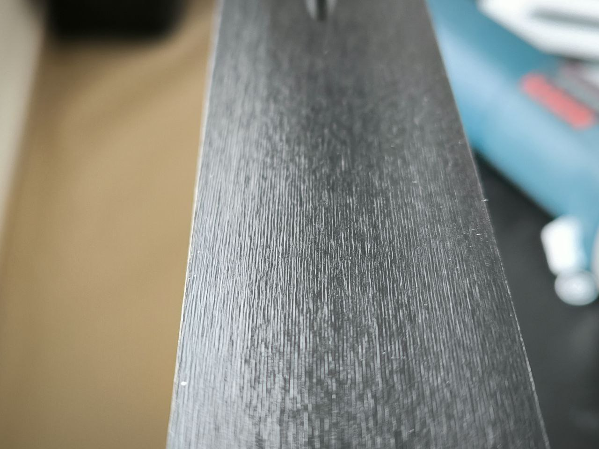

# Структуры Steinschliff

Справочник по структурам лыж на разную погоду и снег.
Цель — собрать опыт, избежать забывания и облегчить выбор в следующем сезоне.

Этот репозиторий содержит информацию о различных структурах для шлифовки лыж.

* [чатик в телеграм](https://t.me/+wddxUugE0gwxMGU6)
* [тема форума на скиспорте](https://www.skisport.ru/forum/cross-country/104594)

Полезные видое:

* [процесс шлифования на сервисе Vuerich Service](https://youtu.be/YPfnXsF2QJg?si=CDNXJfvW0YkthP9a)
* [обзор редких стрктур Рамзау](https://vkvideo.ru/video-220482174_456239484)
* [обзор штайншлифта в ЭкипТайме](https://www.youtube.com/watch?v=IN1FKSIZT2I)

## Оглавление

### Россия

* [Ekiptime (Москва)](#ekiptime-москва)
* [Marsport (Одинцово)](#marsport-одинцово)
* [Serviccer (Красногорск)](#serviccer-красногорск)
* [Skipole (Москва)](#skipole-москва)
* [Svecky (Новосибирск)](#svecky-новосибирск)
* [Uventa (Москва)](#uventa-москва)

### Austria

* [Beme](#beme)
* [Fischer](#fischer)
* [Salomon](#salomon)

### Germany

* [Ramsau](#ramsau)

### Norway

* [Madshus](#madshus)

## Beme

Структуры для беговых лыж от Бенжамина Эдера, сервис Beme

Сайт: [Beme](https://www.bemesports.com/en/skiservice)

### Контактная информация

| Название | Описание | Тип снега | Температура | Изображение | Теги | Похожие структуры | Особенности |
|------|------------|-----------|------------|------|------|-------------------|-------------------|
| [B2211](schliffs/beme/B2211.yaml) | универсальная структура на все типы снега, особенно на свеже выпавший снег | all, fresh | -1 -12 |  | универсальная, свежий снег, все типы снега | [P5-1](schliffs/fischer/P5-1.yaml), [S12-16](schliffs/ramsau/S12-16.yaml) |  |
| [B227](schliffs/beme/B227.yaml) | стуктура для морозного снега и температуры ниже -5 | cold | -5 -20 |  |  | РL1, [S11-3](schliffs/ramsau/S11-3.yaml) |  |
| [B3312](schliffs/beme/B3312.yaml) | струтура на переходку и тепло, на влажный, но не жидкий снег | wet, transformed | +5 -5 |  | переходка, тепло, влажный | [S13-5](schliffs/ramsau/S13-5.yaml), [S13-4](schliffs/ramsau/S13-4.yaml) |  |

## Ekiptime (Москва)

Структуры для беговых лыж от компании Ekiptime

Сайт: [Ekiptime](https://ekiptime.ru/services/base_tuning.php)

Адрес: Москва, стадион Динамо, ВТБ Арена Плаза, Ленинградский проспект, 36

Обзор: [Ekiptime](https://www.youtube.com/watch?v=IN1FKSIZT2I)

### Контактная информация

Phones: [+74997043525](tel:+74997043525)

| Название | Описание | Тип снега | Температура | Изображение | Теги | Похожие структуры | Особенности |
|------|------------|-----------|------------|------|------|-------------------|-------------------|
| [SIGMA](schliffs/ekiptime/SIGMA.yaml) | структура для трансформированного старого весеннего снега с водой | wet, old, dirty, transformed | +15 0 |  | мокрый, старый, грязный, трансформированный, весенний |  |  |
| [SV77](schliffs/ekiptime/SV77.yaml) | универсальная структура на средний холод и низкой влажности при температуре от -0 до -20 | cold, dry, old, fresh | 0 -20 |  | холодный, сухой, свежий, старый |  |  |

## Fischer

Стандартные структуры Fischer

Сайт: [Fischer](https://www.fischersports.com)

### Контактная информация

| Название | Описание | Тип снега | Температура | Изображение | Теги | Похожие структуры | Особенности |
|------|------------|-----------|------------|------|------|-------------------|-------------------|
| [C12-7](schliffs/fischer/C12-7.yaml) | мелкозернистый снег на температуре от 0 до -10 | fine_grained | 0 -10 |  | мелкозернистый, средняя температура | [S13-5-08](schliffs/ramsau/S13-5-08.yaml) |  |
| [P1-1](schliffs/fischer/P1-1.yaml) | структура для свежего снега при температуре +3 до -5 | fresh | +3 -5 |  | свежий снег, умеренный | [P10-3](schliffs/fischer/P10-3.yaml), [S12-2](schliffs/ramsau/S12-2.yaml) |  |
| [P10-1](schliffs/fischer/P10-1.yaml) | для сухого снега при температуре ниже 0 | dry |  |  | сухой снег, минусовая температура | [S11-1](schliffs/ramsau/S11-1.yaml), [Р5-0](schliffs/fischer/Р5-0.yaml) |  |
| [P10-3](schliffs/fischer/P10-3.yaml) | структура для падающего свежего снега, температура от 0 до -5 | fresh, falling | 0 -5 |  | падающий снег, свежий, легкий мороз | [S12-6](schliffs/ramsau/S12-6.yaml), [P1-1](schliffs/fischer/P1-1.yaml) |  |
| [P11-1](schliffs/fischer/P11-1.yaml) | чуть холоднее чем P11-2 | all | 0 -10 |  | универсальный, средняя температура | [P11-2](schliffs/fischer/P11-2.yaml), [P5-1](schliffs/fischer/P5-1.yaml) | чуть холоднее чем P11-2 |
| [P11-2](schliffs/fischer/P11-2.yaml) | все типы снега при температуре от +2 до -8 | all | +2 -8 |  | универсальный, широкий диапазон | [P11-1](schliffs/fischer/P11-1.yaml), [P5-1](schliffs/fischer/P5-1.yaml), [P22-6](schliffs/fischer/P22-6.yaml) |  |
| [P22-6](schliffs/fischer/P22-6.yaml) | переходная структура на любой тип снега, температура от +5 до -5 | all | +5 -5 |  | универсальный, переходная структура, широкий диапазон | [P5-1](schliffs/fischer/P5-1.yaml), [P11-2](schliffs/fischer/P11-2.yaml) | переходная структура |
| [P5-1](schliffs/fischer/P5-1.yaml) | универсальная структура для любого типа снега на температуру от +5 до -10 | all | +5 -10 |  | универсальный, широкий диапазон |  | стандартная |
| [P9-2](schliffs/fischer/P9-2.yaml) | влажный снег, t выше 0 | wet |  |  | влажный снег, плюсовая температура | [Р3-1](schliffs/fischer/Р3-1.yaml), [S13-5](schliffs/ramsau/S13-5.yaml) |  |
| [TZ1-1](schliffs/fischer/TZ1-1.yaml) | на свежий снег при температуре ниже 0 | fresh |  |  | свежий снег, минусовая температура | [P10-3](schliffs/fischer/P10-3.yaml), [S12-2](schliffs/ramsau/S12-2.yaml) |  |
| [Р3-1](schliffs/fischer/Р3-1.yaml) | структура на свежий влажный снег, на 0 градусов с переходом в плюсовую | fresh, wet |  |  | свежий снег, влажный, плюсовая температура | [Р3-2](schliffs/fischer/Р3-2.yaml), [S13-5](schliffs/ramsau/S13-5.yaml) |  |
| [Р3-2](schliffs/fischer/Р3-2.yaml) | на старый мокрый снег при t 0 с переходом в плюс | old, wet |  |  | старый снег, мокрый, плюсовая температура | [Р3-1](schliffs/fischer/Р3-1.yaml), [Р5-9](schliffs/fischer/Р5-9.yaml) |  |
| [Р3-3](schliffs/fischer/Р3-3.yaml) | водянистый снег от +3 до +15 | watery, wet | +15 +3 |  | водянистый снег, высокая температура |  |  |
| [Р5-0](schliffs/fischer/Р5-0.yaml) | сухой мелкий снег от 0 до -5 | dry, old, fine | 0 -5 |  | сухой, старый, мелкозернистый, мелкий снег | [S12-6](schliffs/ramsau/S12-6.yaml) |  |
| [Р5-9](schliffs/fischer/Р5-9.yaml) | структура для классических лыж на старый мокрый снег, температура от 0 и выше | old, wet |  |  | классические лыжи, старый снег, мокрый | [Р3-2](schliffs/fischer/Р3-2.yaml), [P9-2](schliffs/fischer/P9-2.yaml) | классический стиль |
| [С1-1](schliffs/fischer/С1-1.yaml) | все типы снега, включая свежий, температура ниже -5 | all, fresh |  |  | холодный, универсальный | [С12-1](schliffs/fischer/С12-1.yaml) |  |
| [С12-1](schliffs/fischer/С12-1.yaml) | любой тип снега, температура от -15 до -5 | all | -5 -15 |  | холодный, универсальный | [С1-1](schliffs/fischer/С1-1.yaml) |  |
| [С3-1](schliffs/fischer/С3-1.yaml) | для искусственного снега, температура ниже -5 | artificial | -25 -5 |  | холодный, искусственный снег | [С8-1](schliffs/fischer/С8-1.yaml), [S12-7](schliffs/ramsau/S12-7.yaml) |  |
| [С8-1](schliffs/fischer/С8-1.yaml) | более узкая структура для искусственного снега от 0 до -10 | artificial | 0 -10 |  | искусственный снег, узкая структура |  |  |

## Madshus

Стандартные структуры для беговых лыж от компании Madshus

Сайт: [Madshus](https://www.madshus.com)

### Контактная информация

| Название | Описание | Тип снега | Температура | Изображение | Теги | Похожие структуры | Особенности |
|------|------------|-----------|------------|------|------|-------------------|-------------------|
| [M61](schliffs/madshus/M61.yaml) | структура для свежего, универсального и трансформированного снега при температуре снега от -1 до -6 | fresh, universal, transformed | -1 -6 |  | свежий снег, универсальный, трансформированный |  |  |
| [M61B](schliffs/madshus/M61В.yaml) | универсальная структура для различных видов снега, в том числе и нового,  при температуре воздуха от +3 до -3 | all, universal, wet | +3 -3 |  | свежий снег, универсальный, трансформированный | [SV100](schliffs/serviccer/SV100.yaml) | оптимальна, когда снег становится немного влажным, хорошо подходит для классических лыж ZERO |
| [M61F](schliffs/madshus/M61F.yaml) | структура для нового и трансформированного сухого снега при температуре от -3 и холоднее | dry, frozen, new, transformed | -3 -20 |  | сухой снег, трансформированный, перемороженый | [G1](schliffs/salomon/G1.yaml), [B227](schliffs/beme/B227.yaml) |  |
| [M61F2](schliffs/madshus/M61F2.yaml) | новая мелкая структура для холодного и сухого снега при температуре от -6 и холоднее | dry, frozen | -6 -25 |  | сухой снег, трансформированный, перемороженый | [G1](schliffs/salomon/G1.yaml), [B227](schliffs/beme/B227.yaml) |  |
| [M62](schliffs/madshus/M62.yaml) | структура для для нового, перемешанного и крупнозернистого снега при высокой влажности, при температуре от -2 и теплее |  | +10 -2 |  | высокая влажность, свежий, перемешанный, крупнозернистый |  | не крупная, за счет чего практически не набирает грязь |
| [M63](schliffs/madshus/M63.yaml) | стуктура для мокрого снега при температуре от 0 и теплее | wet | +10 0 |  | мокрый снег, перемешанный, крупнозернистый |  |  |

## Marsport (Одинцово)

Кастомные структуры для беговых лыж от компании Марспорт

Сайт: [Марспорт](https://marsport.ru/service)

Адрес: г. Одинцово ул. Манжосовская 1

### Контактная информация

Phones: [+79250464773](tel:+79250464773)

| Название | Описание | Тип снега | Температура | Изображение | Теги | Похожие структуры | Особенности |
|------|------------|-----------|------------|------|------|-------------------|-------------------|
| [C100](schliffs/marsport/C100.yaml) | мелкая холодная структура на мороз | frozen, fresh | -10 -25 |  | перемороженный, холодный | [S11-3](schliffs/ramsau/S11-3.yaml), [B227](schliffs/beme/B227.yaml), [G1](schliffs/salomon/G1.yaml), [Х20](schliffs/skipole/Х20.yaml) |  |
| [F1](schliffs/marsport/F1.yaml) | стуктура для весеннего влажного снега | wet, old, dirty | +5 -5 |  | влажный, старый, грязный | [S13-5](schliffs/ramsau/S13-5.yaml) |  |
| [M100](schliffs/marsport/M100.yaml) | структура для высокой влажности и свежего снега, подходит под глянец, температура от 0 до -10 | fresh | 0 -10 |  | свежий снег, высокая влажность, глянец | [P5-1](schliffs/fischer/P5-1.yaml), [S12-16](schliffs/ramsau/S12-16.yaml), [B2211](schliffs/beme/B2211.yaml), [SV77](schliffs/ekiptime/SV77.yaml), X25 |  |
| [SM15-5](schliffs/marsport/SM15-5.yaml) | универсальная структура для среднего холода и низкой влажности при температуре от -15 до -5 | fresh, transformed | -5 -15 |  | свежий снег, средний холод | [S12-4](schliffs/ramsau/S12-4.yaml), [B227](schliffs/beme/B227.yaml) |  |

## Ramsau

Широко известные структуры для беговых лыж от сервисного центра Ramsau

### Контактная информация

| Название | Описание | Тип снега | Температура | Изображение | Теги | Похожие структуры | Особенности |
|------|------------|-----------|------------|------|------|-------------------|-------------------|
| [OH3](schliffs/ramsau/OH3.yaml) | структура на переходку и тепло при температуре от +5 до -7 | all | +5 -7 |  |  | [B3312](schliffs/beme/B3312.yaml) | появился шлифт относительно недавно, сильно позднее S-шлифтов |
| [PL1](schliffs/ramsau/PL1.yaml) | структура на средний холод и мороз при температуре -5 и холоднее | all, frozen |  |  |  | [S12-4](schliffs/ramsau/S12-4.yaml), [S11-3](schliffs/ramsau/S11-3.yaml), [B227](schliffs/beme/B227.yaml) |  |
| [PL2](schliffs/ramsau/PL2.yaml) | универсальный шлифт как для свежего снега так и для трансформированого при температуре от 0 до -10 | all, fresh, transformed | 0 -10 |  |  | [S12-16](schliffs/ramsau/S12-16.yaml), [B2211](schliffs/beme/B2211.yaml) |  |
| [R2](schliffs/ramsau/R2.yaml) | структура на средний холод при температуре от -5 до -15 | all, frozen | -5 -15 |  | ramsau |  | создавалась под ЧМ по биатлону в Антхольце |
| [S11-1](schliffs/ramsau/S11-1.yaml) | сухой снег на температуре от -10 до -20 | dry | -10 -20 |  | сухой снег, холодный | [S11-2](schliffs/ramsau/S11-2.yaml), [S11-3](schliffs/ramsau/S11-3.yaml) |  |
| [S11-2](schliffs/ramsau/S11-2.yaml) | структура для холодного сухого натурального снега, температура от -10 до -20 | dry, natural, cold | -10 -20 |  | холодный, сухой снег, натуральный снег | [B227](schliffs/beme/B227.yaml), [C100](schliffs/marsport/C100.yaml) |  |
| [S11-3](schliffs/ramsau/S11-3.yaml) | структура под натуральный и искусственный перемороженный снег, температура от -10 до -20 | frozen, natural, artificial | -10 -20 |  | перемороженый, искусственный снег, холодный | [B227](schliffs/beme/B227.yaml) |  |
| [S12-1](schliffs/ramsau/S12-1.yaml) | свежий натуральный и искусственный снег, температура от -15 до 0 | fresh, natural, artificial | 0 -15 |  | свежий снег, натуральный снег, искусственный снег | [S12-2](schliffs/ramsau/S12-2.yaml), [S12-7](schliffs/ramsau/S12-7.yaml) |  |
| [S12-12](schliffs/ramsau/S12-12.yaml) | старый снег при температуре от 0 до -5 | old | 0 -5 |  | старый снег, легкий мороз | [Р3-2](schliffs/fischer/Р3-2.yaml) |  |
| [S12-14](schliffs/ramsau/S12-14.yaml) | на перемороженный снег в период потепления, свежий снег, температура от -2 до -10 | frozen, fresh | -2 -10 |  | перемороженный снег, свежий снег, потепление | [S12-4](schliffs/ramsau/S12-4.yaml), [S12-16](schliffs/ramsau/S12-16.yaml) |  |
| [S12-16](schliffs/ramsau/S12-16.yaml) | универсальная структура для высокой влажности и свежего снега, подходит под глянец, температура от 0 до -10 | fresh | 0 -10 |  | свежий снег, высокая влажность, глянец | [B2211](schliffs/beme/B2211.yaml) |  |
| [S12-2](schliffs/ramsau/S12-2.yaml) | свежий мокрый снег, температура от -5 до 0 | fresh, wet | 0 -5 |  | свежий снег, мокрый, легкий мороз | [S12-6](schliffs/ramsau/S12-6.yaml), [P10-3](schliffs/fischer/P10-3.yaml) |  |
| [S12-2-07](schliffs/ramsau/S12-2-07.yaml) | для свежего снега и мягкой лыжни 0 -10 | fresh | 0 -10 |  | свежий снег, мягкая лыжня | [S12-2](schliffs/ramsau/S12-2.yaml), [S12-3](schliffs/ramsau/S12-3.yaml) |  |
| [S12-3](schliffs/ramsau/S12-3.yaml) | свежий снег под t -2 -6 | fresh | -2 -6 |  | свежий снег, узкий диапазон | [S12-2](schliffs/ramsau/S12-2.yaml), [S12-4](schliffs/ramsau/S12-4.yaml) |  |
| [S12-4](schliffs/ramsau/S12-4.yaml) | универсальная структура для всех трасс с сухим снегом, температура от -2 до -15 | fresh, dry | -2 -15 |  | свежий снег, сухой, холодный | [SM15-5](schliffs/marsport/SM15-5.yaml) |  |
| [S12-6](schliffs/ramsau/S12-6.yaml) | универсальная структура для всех трасс со свежим снегом, падающим и мокрым снегом, температура от 0 до -15 | fresh, falling, wet | 0 -15 |  | падающий снег, свежий, мокрый |  |  |
| [S12-7](schliffs/ramsau/S12-7.yaml) | искусственный снег, температура от -2 до -12 | artificial | -2 -12 |  | искусственный снег, широкий диапазон | [С8-1](schliffs/fischer/С8-1.yaml), [S11-3](schliffs/ramsau/S11-3.yaml) |  |
| [S13-4](schliffs/ramsau/S13-4.yaml) | влажный снег, натуральный и искусственный, переменчивая погода, большой диапазон | wet, natural, artificial |  |  | влажный снег, натуральный снег, искусственный снег, широкий диапазон | [P5-1](schliffs/fischer/P5-1.yaml), [S13-5](schliffs/ramsau/S13-5.yaml) | большой диапазон |
| [S13-5](schliffs/ramsau/S13-5.yaml) | свежий падающий мокрый снег, температура от 0 до +5 | fresh, falling, wet | +5 0 |  | свежий снег, падающий снег, мокрый, плюсовая температура | [F1](schliffs/marsport/F1.yaml), [M63](schliffs/madshus/M63.yaml) |  |
| [S13-5-08](schliffs/ramsau/S13-5-08.yaml) | влажный мелкозернистый свежий снег | wet, fine_grained, fresh |  |  | мелкозернистый, влажный, свежий | [S13-5](schliffs/ramsau/S13-5.yaml), [C12-7](schliffs/fischer/C12-7.yaml) |  |
| [S13-6](schliffs/ramsau/S13-6.yaml) | мокрый снег с дождем, температура от 0 до +10 | wet | +10 0 |  | мокрый снег, дождь, плюсовая температура | [F1](schliffs/marsport/F1.yaml), [M63](schliffs/madshus/M63.yaml) |  |
| [T1](schliffs/ramsau/T1.yaml) | стуктура для крупнозернистого снега, весеннего старого снега и температуры от 0 до +5 | old, wet, dirty | +5 0 |  | крупнозернистый | [S13-5](schliffs/ramsau/S13-5.yaml), [B3312](schliffs/beme/B3312.yaml) |  |
| [T4](schliffs/ramsau/T4.yaml) | стуктура для морозного снега и температуры ниже -5 | frozen, dry | -5 -20 |  |  | [B227](schliffs/beme/B227.yaml) |  |
| [V1](schliffs/ramsau/V1.yaml) | морозная структура для натурального снега при -5 и холоднее | all, fresh, frozen, natural | -5 -20 |  | ramsau | [B227](schliffs/beme/B227.yaml) |  |

## Salomon

Стандартные структуры для беговых лыж от компании Salomon

Сайт: [Salomon](https://www.salomon.com)

### Контактная информация

| Название | Описание | Тип снега | Температура | Изображение | Теги | Похожие структуры | Особенности |
|------|------------|-----------|------------|------|------|-------------------|-------------------|
| [G1](schliffs/salomon/G1.yaml) | натуральный холодный снег на температуру -5 и холоднее | natural, cold, dry | -5 -20 |  | сухой, холодный, натуральный | С12-4 |  |
| [SL1](schliffs/salomon/SL1.yaml) | структура для натурального холодного и сухого снега, допустима в смесь натурального и искусственного при низкой влажности от -10 и холоднее | natural, artificial, dry, frozen | -10 -30 |  | сухой, холодный, перемороженный, натуральный, искусственный, смешеный | С11-3, [B227](schliffs/beme/B227.yaml), [SV700](schliffs/serviccer/SV700.yaml), [C100](schliffs/marsport/C100.yaml) |  |
| [SL21](schliffs/salomon/SL21.yaml) | стандартная структура для жестких трасс, натуральный и искусственный снег, температура от +1 до -7 | natural, artificial | +1 -7 |  | натуральный, искусственный, смешеный | [S12-16](schliffs/ramsau/S12-16.yaml), [S12-6](schliffs/ramsau/S12-6.yaml), [B2211](schliffs/beme/B2211.yaml), [SV600](schliffs/serviccer/SV600.yaml), [M100](schliffs/marsport/M100.yaml) |  |
| [SL32](schliffs/salomon/SL32.yaml) | структура для влажного и очень мокрого старого снега, а также для грязного снега при средней и мягкой жесткости трассы | wet, transformed, dirty | +15 0 |  | влажный, мокрый, грязный, старый | [S13-5](schliffs/ramsau/S13-5.yaml), [S13-4](schliffs/ramsau/S13-4.yaml) |  |
| [SLRGL](schliffs/salomon/SLRGL.yaml) | структура на переменную от холода на тепло и на жесткую трассу и искусственный снег | natural, artificial, wet | +5 -3 |  | влажный, мокрый, грязный, старый, искусственный | [S13-5](schliffs/ramsau/S13-5.yaml), [S13-4](schliffs/ramsau/S13-4.yaml), [B3312](schliffs/beme/B3312.yaml), [SV100](schliffs/serviccer/SV100.yaml) |  |

## Serviccer (Красногорск)

Структуры для беговых лыж от лыжного сервиса SERVICCER

Сайт: [Serviccer](https://serviccer.ru/strukturyi.html)

Адрес: МО, г.Красногорск, ул.Речная д.37 за зданием спортивной школы Waх-кабина "SERVICCER"

### Контактная информация

Email: servicerski@yandex.ru

Phones: [+79104316887](tel:+79104316887), [+79779055104](tel:+79779055104)

| Название | Описание | Тип снега | Температура | Изображение | Теги | Похожие структуры | Особенности |
|------|------------|-----------|------------|------|------|-------------------|-------------------|
| [R10-3](schliffs/serviccer/R10-3.yaml) |  |  |  |  |  |  |  |
| [SV100](schliffs/serviccer/SV100.yaml) | стурктура для глянца, старого и свежего снег, замыленный снега и температуры от +3 до -3 | fresh, old, glossy | +3 -3 |  | глянец, замыленный |  | не едет в воду |
| [SV600](schliffs/serviccer/SV600.yaml) |  |  |  |  |  |  |  |
| [SV700](schliffs/serviccer/SV700.yaml) |  |  |  |  |  |  |  |

## Skipole (Москва)

Кастомные структуры от Федора Николаева

Сайт: [Skipole](https://shtainshlift.ru)

Адрес: Москва, село Ромашково, ул.Советская, д.113

### Контактная информация

Telegram: [Nikfedval](https://t.me/Nikfedval)

Phones: [+79261489013](tel:+79261489013), [+79032181881](tel:+79032181881)

| Название | Описание | Тип снега | Температура | Изображение | Теги | Похожие структуры | Особенности |
|------|------------|-----------|------------|------|------|-------------------|-------------------|
| [W28](schliffs/skipole/W28.yaml) | переходная структура на любой тип снега при температуре от +3 до -3 | all | +3 -3 |  | переходная | [SV100](schliffs/serviccer/SV100.yaml), [F1](schliffs/marsport/F1.yaml) | Может ехать лучше ожидаемого, если снег уже сильно трансформирован. |
| [W30](schliffs/skipole/W30.yaml) | стуктура для мокрого снега с дождём | wet, rain | +10 0 |  | мокрый снег, дождь |  |  |
| [Х0](schliffs/skipole/Х0.yaml) | структура для натурального сухого снега при температуре ниже -12 | frozen, dry, natural | -12 -25 |  | сухой снег, натуральный снег |  |  |
| [Х20](schliffs/skipole/Х20.yaml) | структура для свежего и старого снега при температуре от -5 до 15 | all, fresh, old | +15 -5 |  | свежий снег |  | При потеплении едет хуже, чем на свежем или падающем снегу. В регионах с низкой влажностью — почти не применяется в начале сезона. Во второй половине — сдвиг на +5–7°C. |
| [Х25](schliffs/skipole/X25.yaml) | стуктура для свежего и нового натурального снега, глянец при температуре от 0 до -8 | all | 0 -8 |  | свежий снег, глянец | [S12-6](schliffs/ramsau/S12-6.yaml), [B2211](schliffs/beme/B2211.yaml), [SV100](schliffs/serviccer/SV100.yaml) |  |

## Svecky (Новосибирск)

Cервис оказывает услуги по нанесению штайншлифа на беговые лыжи используя машину [Delta](https://www.svecomski.com/en/products/machines/delta-research-160-2) от фирмы [SVECOM SKI](http://www.svecomski.com).

Сайт: [Svecky Racing](http://svecky.racing/)

Адрес: Новосибирск, Академгородок, ул. Ионосферная 3

### Контактная информация

Telegram: [svecky](https://t.me/svecky)

Phones: [+7(9I3)478-29-59](tel:+7(9I3)478-29-59), [+7(9I3)ООО-О4-ОО](tel:+7(9I3)ООО-О4-ОО)

| Название | Описание | Тип снега | Температура | Изображение | Теги | Похожие структуры | Особенности |
|------|------------|-----------|------------|------|------|-------------------|-------------------|
| [16-4](schliffs/svecky/16-4.yaml) | Универсальная тёплая структура в том числе на очень влажные условия | all, wet | +10 -1 |  | универсальная, тёплая, влажные условия |  |  |
| [LiB](schliffs/svecky/LiB.yaml) | Тёплая структура на свежий снег, высокая влажность | fresh, new | +5 -4 |  | тёплая, свежий снег, высокая влажность |  |  |
| [P51-33](schliffs/svecky/P51-33.yaml) | Универсальная структура | all, transformed, old | +2 -9 |  | универсальная, трансформированный снег |  | Не подходит для мелкого свежего снега |
| [PRG](schliffs/svecky/PRG.yaml) | Структура на трансформированный, ратрачный снег на средне-холодные температуры | transformed, groomed | -5 -13 |  | трансформированный снег, ратрачный снег, холодная |  | Для хорошо подготовленных трасс |
| [TP50](schliffs/svecky/TP50.yaml) | Для мокрых кондиций, хорошо проявила себе под проливным дождем | wet, rain | +10 0 |  | дождь, мокрый снег, влажные условия |  |  |
| [VT1.3](schliffs/svecky/VT1.3.yaml) | Холодная структура, хорошо работает в раскат | used, transformed | -4 -16 |  | холодная, трансформированный снег |  |  |
| [VT3-2](schliffs/svecky/VT3-2.yaml) | Структура на свежий снег при холодных температурах | fresh, new | -3 -12 |  | свежий снег, холодная |  |  |
| [VT322](schliffs/svecky/VT322.yaml) | Структура для классики на мелкозернистый и свежий снег | fine, fresh | 0 -16 |  | классический стиль, мелкозернистый снег, свежий снег |  | cпециально для классического стиля |

## Uventa (Москва)

Кастомные структуры для беговых лыж от сервисного центра Ювента Спорт

Сайт: [Ювента Спорт](https://www.uventasport.ru/company/servis-centr/shtaynshlift/)

Адрес: Москва

### Контактная информация

| Название | Описание | Тип снега | Температура | Изображение | Теги | Похожие структуры | Особенности |
|------|------------|-----------|------------|------|------|-------------------|-------------------|
| [330](schliffs/uventa/330.yaml) | Холодная структура для утрамбованного, преобразованного и жесткого снега, температурный диапазон от -5°C до -20°C | frozen, cold, transformed | -5 -20 |  | холодная, утрамбованный снег, преобразованный снег, жесткий снег | [C110X](schliffs/uventa/C110X.yaml) |  |
| [729](schliffs/uventa/729.yaml) | Универсальная структура для свежего и старого снега, температурный диапазон от +2°C до -12°C | fresh, old, universal | +2 -12 |  | универсальная, свежий снег, старый снег | [N33](schliffs/uventa/N33.yaml) |  |
| [C110X](schliffs/uventa/C110X.yaml) | Холодная структура для нового и преобразованного снега, температурный диапазон от -10°C до -20°C | fresh, transformed | -10 -20 |  | холодная, новый снег, преобразованный снег | [330](schliffs/uventa/330.yaml) |  |
| [N33](schliffs/uventa/N33.yaml) | Переходная структура для любого типа снега, температурный диапазон от +5°C до -5°C | all | +5 -5 |  | переходная, универсальная, любой снег | [X1W](schliffs/uventa/X1W.yaml), [729](schliffs/uventa/729.yaml) |  |
| [SL7](schliffs/uventa/SL7.yaml) | Для свежего и слабо преобразованного снега, температурный диапазон от -3°C до -10°C | fresh, slightly_transformed | -3 -10 |  | свежий снег, слабо преобразованный снег | [729](schliffs/uventa/729.yaml) |  |
| [X1W](schliffs/uventa/X1W.yaml) | Переходная структура для любого типа снега, температурный диапазон от +2°C до -2°C | all | +2 -2 |  | переходная, универсальная, любой снег | [N33](schliffs/uventa/N33.yaml) |  |
| [X3LS](schliffs/uventa/X3LS.yaml) | На влажный старый, преобразованный и грязный снег, температурный диапазон от +10°C до -2°C | wet, old, transformed, dirty | +10 -2 |  | влажный снег, старый снег, преобразованный снег, грязный снег | [Z1](schliffs/uventa/Z1.yaml) |  |
| [Z1](schliffs/uventa/Z1.yaml) | Для глянца, жесткой трассы и сильно преобразованного снега, температурный диапазон от 0°C до -5°C | transformed, hard, glazed | 0 -5 |  | глянец, жесткая трасса, преобразованный снег | [X3LS](schliffs/uventa/X3LS.yaml) |  |

