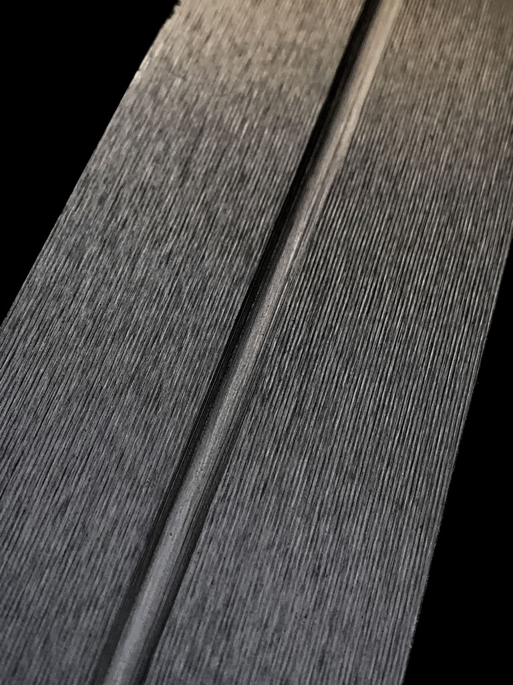
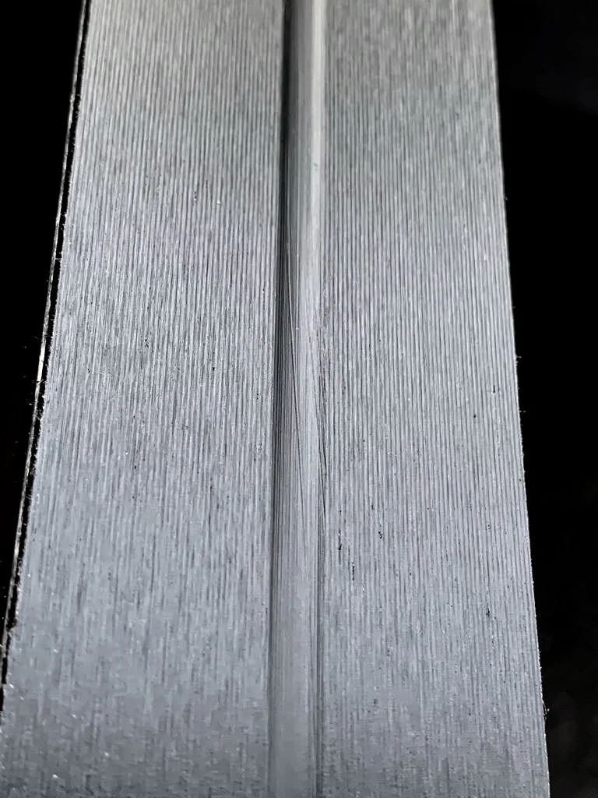

# ❄️ Awesome Steinschliff

A comprehensive guide to ski structures for various weather and snow conditions.
The goal is to collect experience and make it easier to choose the right structure next season.

* [Telegram chat](https://t.me/+wddxUugE0gwxMGU6)
* [Forum thread on skisport.ru](https://www.skisport.ru/forum/cross-country/104594)

Useful videos:

* [Stone grinding process at Vuerich Service](https://youtu.be/YPfnXsF2QJg?si=CDNXJfvW0YkthP9a)
* [Review of rare Ramsau structures](https://vkvideo.ru/video-220482174_456239484)
* [Steinschliff overview at EkipTime](https://www.youtube.com/watch?v=IN1FKSIZT2I)

## Table of Contents

### Russia

* [Ekiptime (Москва)](#ekiptime-москва)
* [Marsport (Одинцово)](#marsport-одинцово)
* [Mass sport (Санкт-Петербург)](#mass-sport-санкт-петербург)
* [Serviccer (Красногорск)](#serviccer-красногорск)
* [Skipole (Москва)](#skipole-москва)
* [Svecky (Новосибирск)](#svecky-новосибирск)
* [Uventa (Москва)](#uventa-москва)

### Austria

* [Atomic](#atomic)
* [Beme](#beme)
* [Fischer](#fischer)
* [Fischer26](#fischer26)
* [Salomon](#salomon)

### France

* [Rossignol](#rossignol)

### Germany

* [Ramsau](#ramsau)

### Norway

* [Madshus](#madshus)

## Structures

## Ekiptime (Москва)

Структуры для беговых лыж от компании Ekiptime

Website: [Ekiptime](https://ekiptime.ru/services/base_tuning.php)

Address: Москва, стадион Динамо, ВТБ Арена Плаза, Ленинградский проспект, 36

Video: [Ekiptime](https://www.youtube.com/watch?v=IN1FKSIZT2I)
### Contact Information

* phones:
  - +74997043525

| Name | Description | Snow Type | Temp Range | Image | Tags | Similar Structures | Features |
|------|------------|-----------|----------------|------|------|-------------------|-------------------|
| [SIGMA](schliffs/ekiptime/SIGMA.yaml) |  | wet, old, dirty, transformed | +15 °C … 0 °C |  | мокрый, старый, грязный, трансформированный, весенний |  |  |
| [UGOL13](schliffs/ekiptime/UGOL13.yaml) |  | watery, water | +15 °C … +2 °C |  | вода, мокрый, горячий |  |  |
| [AW22](schliffs/ekiptime/AW22.yaml) |  | extreme_humidity, wet | +15 °C … 0 °C |  | экстремальная влажность, мокрый | [AW2](schliffs/ekiptime/AW2.yaml) |  |
| [AW8](schliffs/ekiptime/AW8.yaml) |  | spring, wet | +10 °C … –5 °C |  | весенний, теплый |  |  |
| [UGOL1](schliffs/ekiptime/UGOL1.yaml) |  | warm, wet | +5 °C … 0 °C |  | теплый, мокрый | [UGOL13](schliffs/ekiptime/UGOL13.yaml) |  |
| [AW7](schliffs/ekiptime/AW7.yaml) |  | coarse, wet, falling, spring | +5 °C … –5 °C |  | крупнозернистый, мокрый, падающий, весенний, Russia |  | накатка для водянистого снега |
| [AW2](schliffs/ekiptime/AW2.yaml) |  | wet, watery, high_humidity | +2 °C … –2 °C |  | влажный, водянистый, высокая влажность |  |  |
| [AM6](schliffs/ekiptime/AM6.yaml) |  | all, coarse, thawed | +1 °C … –8 °C |  | универсальный, крупнозернистый, оттепель |  |  |
| [AW4](schliffs/ekiptime/AW4.yaml) |  | coarse, spring | 0 °C … –2 °C |  | крупнозернистый, весенний, Russia, накатка |  | ручная накатка |
| [SV77](schliffs/ekiptime/sv77.yaml) |  | cold, dry, old, fresh | 0 °C … –20 °C |  | холодный, сухой, свежий, старый |  |  |
| [AW1](schliffs/ekiptime/AW1.yaml) |  | wet, damp | 0 °C … –4 °C |  | влажный, мокрый |  |  |
| [AM7-2](schliffs/ekiptime/AM7-2.yaml) |  | fresh, high_humidity | 0 °C … –6 °C |  | свежий, высокая влажность | [AM7](schliffs/ekiptime/AM7.yaml) |  |
| [AM2](schliffs/ekiptime/AM2.yaml) |  | fresh, wet, frozen | –1 °C … –8 °C |  | свежий, влажный, подмороженный |  |  |
| [AM3](schliffs/ekiptime/AM3.yaml) |  | all, natural, artificial | –2 °C … –10 °C |  | натуральный, искусственный |  |  |
| [AM7](schliffs/ekiptime/AM7.yaml) |  | all, fresh, cold | –4 °C … –12 °C |  | универсальный, свежий, холодный, Russia |  |  |
| [AM26](schliffs/ekiptime/AM26.yaml) |  | natural, high_humidity | –5 °C … –12 °C |  | натуральный, высокая влажность |  |  |
| [AC4](schliffs/ekiptime/AC4.yaml) |  | all, cold | –5 °C … –20 °C |  | холодный, универсальный |  |  |
| [G1](schliffs/ekiptime/G1.yaml) |  | cold, extremely_cold, dry | –5 °C … –30 °C |  | холодный, экстремально холодный, сухой, реплика | [G1](schliffs/salomon/G1.yaml), [B227](schliffs/beme/B227.yaml) |  |
| [AC5](schliffs/ekiptime/AC5.yaml) |  | all, cold | –8 °C … –25 °C |  | холодный, универсальный, Russia |  |  |
| [AC3](schliffs/ekiptime/AC3.yaml) |  | cold, old, scandinavian | –8 °C … –17 °C |  | холодный, скандинавский |  |  |

## Marsport (Одинцово)

Структуры для беговых лыж от компании Марспорт

Website: [Marsport](https://marsport.ru/service)

Address: г. Одинцово ул. Манжосовская 1

### Contact Information

* phones:
  - +79250464773

| Name | Description | Snow Type | Temp Range | Image | Tags | Similar Structures | Features |
|------|------------|-----------|----------------|------|------|-------------------|-------------------|
| [F1](schliffs/marsport/F1.yaml) |  | wet, old, dirty | +5 °C … –5 °C |  | влажный, старый, грязный | [S13-5](schliffs/ramsau/S13-5.yaml) |  |
| [M100](schliffs/marsport/M100.yaml) |  | fresh | 0 °C … –10 °C |  | свежий снег, высокая влажность, глянец | [P5-1](schliffs/fischer/P5-1.yaml), [S12-16](schliffs/ramsau/S12-16.yaml), [B2211](schliffs/beme/B2211.yaml), [SV77](schliffs/ekiptime/sv77.yaml), [X25](schliffs/skipole/X25.yaml) |  |
| [SM15-5](schliffs/marsport/SM15-5.yaml) |  | fresh, transformed | –5 °C … –15 °C |  | свежий снег, средний холод | [S12-4](schliffs/ramsau/S12-4.yaml), [B227](schliffs/beme/B227.yaml) |  |
| [C100](schliffs/marsport/C100.yaml) |  | frozen, fresh | –10 °C … –25 °C |  | перемороженный, холодный | [S11-3](schliffs/ramsau/S11-3.yaml), [B227](schliffs/beme/B227.yaml), [G1](schliffs/salomon/G1.yaml), [X20](schliffs/skipole/X20.yaml) |  |

## Mass Sport (Санкт-Петербург)

Stone grind service with Svekom Ski World Cup Evo (partnered with YTC Ski Service)

Website: [Mass Sport](https://www.skisport.ru/news/cross-country/119865/)

Address: УТЦ «Кавголово» — по предварительной записи (пос. Токсово, ул. Лесгафта 35/2).
Пункты приёма MASS SPORT: ТК «Вояж» (пр. Энгельса, 124/1, 5 вход, 3 этаж) и «Охта Парк» (дер. Мистолово, ул. Людмилы Кедриной).

### Contact Information

* phones:
  - +7 (911) 956-93-80
  - +7 (963) 329-00-24

| Name | Description | Snow Type | Temp Range | Image | Tags | Similar Structures | Features |
|------|------------|-----------|----------------|------|------|-------------------|-------------------|
| [T1.3](schliffs/mass%20sport/T1.3.yaml) | For wet transformed snow 0..+10°C | transformed, wet | +10 °C … 0 °C |  | мокрый снег, трансформированный снег, тепло |  |  |
| [Fit-4](schliffs/mass%20sport/Fit-4.yaml) | All-snow structure for 0..+8°C except falling snow, mid-high humidity | natural, artificial, transformed | +8 °C … 0 °C |  | тепло, средняя влажность, высокая влажность |  |  |
| [T20-10](schliffs/mass%20sport/T20-10.yaml) | For fresh snow around 0°C, high humidity | fresh, natural, artificial | +3 °C … –3 °C |  | свежий снег, высокая влажность, около нуля |  |  |
| [T1.3fa](schliffs/mass%20sport/T1.3fa.yaml) | For old transformed snow around 0°C, mid-high humidity | transformed | +3 °C … –3 °C |  | трансформированный снег, около нуля, средняя влажность, высокая влажность |  |  |
| [Fit-10](schliffs/mass%20sport/Fit-10.yaml) | Universal cold structure for natural and artificial snow, high humidity | natural, artificial, all | –3 °C … –15 °C |  | универсальный, высокая влажность, холодный |  |  |
| [-15T1](schliffs/mass%20sport/-15T1.yaml) | For fresh and old refrozen snow, very cold | fresh, old, refrozen, natural, artificial | –10 °C … –25 °C |  | перемороженный снег, очень холодно |  |  |

## Serviccer (Красногорск)

Website: [Serviccer](https://serviccer.ru/strukturyi.html)

Address: МО, г.Красногорск, ул.Речная д.37 за зданием спортивной школы Waх-кабина "SERVICCER"

### Contact Information

* email: <servicerski@yandex.ru>
* phones:
  - +79104316887
  - +79779055104

| Name | Description | Snow Type | Temp Range | Image | Tags | Similar Structures | Features |
|------|------------|-----------|----------------|------|------|-------------------|-------------------|
| [SR12-3](schliffs/serviccer/SR12-3.yaml) |  | transformed, wet, water | +10 °C … +3 °C |  | весенний снег, вода, тепло |  |  |
| [SV150](schliffs/serviccer/SV150.yaml) |  | spring | +5 °C … +3 °C |  | тепло, весенний снег |  |  |
| [W1](schliffs/serviccer/W1.yaml) |  | classic, coarse, glossy | +3 °C … 0 °C |  | классика, крупное зерно, глянец |  |  |
| [SV100](schliffs/serviccer/SV100.yaml) |  | fresh, old, glossy | +3 °C … –3 °C |  | глянец, замыленный |  | не едет в воду |
| [SR15](schliffs/serviccer/SR15.yaml) |  | transformed | +3 °C … –3 °C |  | фирн, трансформированный |  |  |
| [G2-2](schliffs/serviccer/G2-2.yaml) |  | all, glossy | +2 °C … –5 °C |  | глянец |  |  |
| [R10-3](schliffs/serviccer/R10-3.yaml) |  | fresh, glossy | 0 °C … –5 °C |  | универсальный, глянец, TOP |  |  |
| [G3.1](schliffs/serviccer/G3.1.yaml) |  | fresh | 0 °C … –5 °C |  | универсальный, свежий снег |  |  |
| [SV600](schliffs/serviccer/SV600.yaml) |  | all | –2 °C … –10 °C |  | универсальный, TOP |  |  |
| [V7-3](schliffs/serviccer/V7-3.yaml) |  | transformed, fine_grained | –2 °C … –15 °C |  | старый снег, подготовленная трасса |  |  |
| [77](schliffs/serviccer/77.yaml) |  | all | –5 °C … –18 °C |  | холод |  |  |
| [SR21](schliffs/serviccer/SR21.yaml) |  | all | –5 °C … –15 °C |  | универсальный |  |  |
| [R11-2](schliffs/serviccer/R11-2.yaml) |  | all, fresh | –8 °C … –18 °C |  | холод, свежий снег |  |  |
| [SV700](schliffs/serviccer/SV700.yaml) |  | all, frozen | –8 °C … –25 °C |  | холод, перемороженный |  |  |
| [R10](schliffs/serviccer/R10.yaml) |  | all | –10 °C … –20 °C |  | холод |  |  |
| [SR23](schliffs/serviccer/SR23.yaml) |  | fresh | –10 °C … –20 °C |  | свежий снег, холод |  |  |

## Skipole (Москва)

Website: [Skipole](https://shtainshlift.ru)

Address: Москва, село Ромашково, ул.Советская, д.113

### Contact Information

* telegram: [Nikfedval](https://t.me/Nikfedval)
* phones:
  - +79261489013
  - +79032181881

| Name | Description | Snow Type | Temp Range | Image | Tags | Similar Structures | Features |
|------|------------|-----------|----------------|------|------|-------------------|-------------------|
| [X20](schliffs/skipole/X20.yaml) |  | all, fresh, old | +15 °C … –5 °C |  | свежий снег |  | При потеплении едет хуже, чем на свежем или падающем снегу. В регионах с низкой влажностью — почти не применяется в начале сезона. Во второй половине — сдвиг на +5–7°C. |
| [W30](schliffs/skipole/W30.yaml) |  | wet, rain | +10 °C … 0 °C |  | мокрый снег, дождь |  |  |
| [W28](schliffs/skipole/W28.yaml) |  | all | +3 °C … –3 °C |  | переходная | [SV100](schliffs/serviccer/SV100.yaml), [F1](schliffs/marsport/F1.yaml) | Может ехать лучше ожидаемого, если снег уже сильно трансформирован. |
| [X25](schliffs/skipole/X25.yaml) |  | all | 0 °C … –8 °C |  | свежий снег, глянец | [S12-6](schliffs/ramsau/S12-6.yaml), [B2211](schliffs/beme/B2211.yaml), [SV100](schliffs/serviccer/SV100.yaml) |  |
| [X0](schliffs/skipole/X0.yaml) |  | frozen, dry, natural | –12 °C … –25 °C |  | сухой снег, натуральный снег |  |  |

## Svecky (Новосибирск)

Website: [Svecky](http://svecky.racing/)

Address: Новосибирск, Академгородок, ул. Ионосферная 3

### Contact Information

* telegram: [svecky](https://t.me/svecky)
* phones:
  - +7(913)478-29-59
  - +7(913)000-04-00

| Name | Description | Snow Type | Temp Range | Image | Tags | Similar Structures | Features |
|------|------------|-----------|----------------|------|------|-------------------|-------------------|
| [16-4](schliffs/svecky/16-4.yaml) | Universal warm structure for high humidity conditions | all, wet | +10 °C … –1 °C |  | универсальная, тёплая, влажные условия |  |  |
| [TP50](schliffs/svecky/TP50.yaml) | Structure for extremely wet conditions and rain | wet, rain | +10 °C … 0 °C |  | дождь, мокрый снег, влажные условия |  |  |
| [LiB](schliffs/svecky/LiB.yaml) | Warm structure for fresh snow, high humidity conditions | fresh, new | +5 °C … –4 °C |  | тёплая, свежий снег, высокая влажность |  |  |
| [P51-33](schliffs/svecky/P51-33.yaml) | Universal structure for varied conditions, except fine fresh snow | all, transformed, old | +2 °C … –9 °C |  | универсальная, трансформированный снег |  | Не подходит для мелкого свежего снега |
| [VT322](schliffs/svecky/VT322.yaml) | Classic skiing structure for fine-grained and fresh snow | fine, fresh | 0 °C … –16 °C |  | классический стиль, мелкозернистый снег, свежий снег |  | cпециально для классического стиля |
| [VT3-2](schliffs/svecky/VT3-2.yaml) | Structure designed for fresh snow in cold conditions | fresh, new | –3 °C … –12 °C |  | свежий снег, холодная |  |  |
| [VT1.3](schliffs/svecky/VT1.3.yaml) | Cold structure optimized for well-used tracks | used, transformed | –4 °C … –16 °C |  | холодная, трансформированный снег |  |  |
| [PRG](schliffs/svecky/PRG.yaml) | Structure for transformed, groomed snow in cold conditions | transformed, groomed | –5 °C … –13 °C |  | трансформированный снег, ратрачный снег, холодная |  | Для хорошо подготовленных трасс |

## Uventa (Москва)

Website: [Uventa](https://www.uventasport.ru/company/servis-centr/shtaynshlift/)

Address: Москва

| Name | Description | Snow Type | Temp Range | Image | Tags | Similar Structures | Features |
|------|------------|-----------|----------------|------|------|-------------------|-------------------|
| [X3LS](schliffs/uventa/X3LS.yaml) | For wet old, transformed and dirty snow, temperature range +10°C to -2°C | wet, old, transformed, dirty | +10 °C … –2 °C |  | влажный снег, старый снег, преобразованный снег, грязный снег | [Z1](schliffs/uventa/Z1.yaml) |  |
| [N33](schliffs/uventa/N33.yaml) | Transition structure for all snow types, temperature range +5°C to -5°C | all | +5 °C … –5 °C |  | переходная, универсальная, любой снег | [X1W](schliffs/uventa/X1W.yaml), [729](schliffs/uventa/729.yaml) |  |
| [729](schliffs/uventa/729.yaml) | Universal structure for fresh and old snow, temperature range +2°C to -12°C | fresh, old, universal | +2 °C … –12 °C |  | универсальная, свежий снег, старый снег | [N33](schliffs/uventa/N33.yaml) |  |
| [X1W](schliffs/uventa/X1W.yaml) | Transition structure for all snow types, temperature range +2°C to -2°C | all | +2 °C … –2 °C |  | переходная, универсальная, любой снег | [N33](schliffs/uventa/N33.yaml) |  |
| [Z1](schliffs/uventa/Z1.yaml) | For glazed surface, hard track and heavily transformed snow, temperature range 0°C to -5°C | transformed, hard, glazed | 0 °C … –5 °C |  | глянец, жесткая трасса, преобразованный снег | [X3LS](schliffs/uventa/X3LS.yaml) |  |
| [SL7](schliffs/uventa/SL7.yaml) | For fresh and slightly transformed snow, temperature range -3°C to -10°C | fresh, slightly_transformed | –3 °C … –10 °C |  | свежий снег, слабо преобразованный снег | [729](schliffs/uventa/729.yaml) |  |
| [330](schliffs/uventa/330.yaml) | Cold structure for packed, transformed and hard snow, temperature range from -5°C to -20°C | frozen, cold, transformed | –5 °C … –20 °C |  | холодная, утрамбованный снег, преобразованный снег, жесткий снег | [C110X](schliffs/uventa/C110X.yaml) |  |
| [C110X](schliffs/uventa/C110X.yaml) | Cold structure for new and transformed snow, temperature range -10°C to -20°C | fresh, transformed | –10 °C … –20 °C |  | холодная, новый снег, преобразованный снег | [330](schliffs/uventa/330.yaml) |  |

## Atomic

Website: [Atomic](https://www.atomic.com)

| Name | Description | Snow Type | Temp Range | Image | Tags | Similar Structures | Features |
|------|------------|-----------|----------------|------|------|-------------------|-------------------|
| [AW7](schliffs/atomic/AW7.yaml) |  | fine_grained, wet | +5 °C … –5 °C |  | крупнозернистый, водянистый, весна, конек, классика |  |  |
| [AW1](schliffs/atomic/AW1.yaml) |  | wet | 0 °C … –4 °C |  | влажный снег, классика |  |  |
| [AM2](schliffs/atomic/AM2.yaml) |  | fresh, wet | –1 °C … –5 °C |  | свежий снег, влажный, конек, классика |  |  |
| [AM6](schliffs/atomic/AM6.yaml) |  | fine_grained, transformed | –1 °C … –8 °C |  | крупнозернистый, конек, классика |  |  |
| [AM1](schliffs/atomic/AM1.yaml) |  | artificial, fresh | –3 °C … –10 °C |  | смешанный снег, конек, классика |  |  |
| [AM7](schliffs/atomic/AM7.yaml) |  | frozen | –4 °C … –15 °C |  | сухой снег, конек, классика |  |  |
| [AC4](schliffs/atomic/AC4.yaml) |  | all | –5 °C … –15 °C |  | холодный, универсальный, высокая влажность, конек, классика |  |  |
| [AC5](schliffs/atomic/AC5.yaml) |  | all | –8 °C … –30 °C |  | очень холодный, универсальный, конек, классика |  |  |
| [AC3](schliffs/atomic/AC3.yaml) |  | all | –8 °C … –17 °C |  | холодный, универсальный, конек, классика |  |  |

## Beme

Website: [Beme](https://www.bemesports.com/en/skiservice)

| Name | Description | Snow Type | Temp Range | Image | Tags | Similar Structures | Features |
|------|------------|-----------|----------------|------|------|-------------------|-------------------|
| [B3312](schliffs/beme/B3312.yaml) |  | wet, transformed | +5 °C … –5 °C |  | переходка, тепло, влажный | [S13-5](schliffs/ramsau/S13-5.yaml), [S13-4](schliffs/ramsau/S13-4.yaml) |  |
| [B2211](schliffs/beme/B2211.yaml) |  | all, fresh | –1 °C … –12 °C |  | универсальная, свежий снег, все типы снега | [P5-1](schliffs/fischer/P5-1.yaml), [S12-16](schliffs/ramsau/S12-16.yaml) |  |
| [B227](schliffs/beme/B227.yaml) |  | cold | –5 °C … –20 °C |  |  | [PL1](schliffs/ramsau/Pl1.yaml), [S11-3](schliffs/ramsau/S11-3.yaml) |  |

## Fischer

Default Fischer structures

Website: [Fischer](https://www.fischersports.com)

| Name | Description | Snow Type | Temp Range | Image | Tags | Similar Structures | Features |
|------|------------|-----------|----------------|------|------|-------------------|-------------------|
| [P3-3](schliffs/fischer/P3-3.yaml) |  | watery, wet | +15 °C … +3 °C |  | водянистый снег, высокая температура |  |  |
| [P5-9](schliffs/fischer/P5-9.yaml) |  | old, wet | +10 °C … 0 °C |  | классические лыжи, старый снег, мокрый | [P3-2](schliffs/fischer/P3-2.yaml), [P9-2](schliffs/fischer/P9-2.yaml) | классический стиль |
| [P9-2](schliffs/fischer/P9-2.yaml) |  | wet | +10 °C … 0 °C |  | влажный снег, плюсовая температура | [P3-1](schliffs/fischer/P3-1.yaml), [S13-5](schliffs/ramsau/S13-5.yaml) |  |
| [P3-2](schliffs/fischer/P3-2.yaml) |  | old, wet | +5 °C … 0 °C |  | старый снег, мокрый, плюсовая температура | [P3-1](schliffs/fischer/P3-1.yaml), [P5-9](schliffs/fischer/P5-9.yaml) |  |
| [P5-1](schliffs/fischer/P5-1.yaml) |  | all | +5 °C … –10 °C |  | универсальный, широкий диапазон |  | стандартная |
| [P22-6](schliffs/fischer/P22-6.yaml) |  | all | +5 °C … –5 °C |  | универсальный, переходная структура, широкий диапазон | [P5-1](schliffs/fischer/P5-1.yaml), [P11-2](schliffs/fischer/P11-2.yaml) | переходная структура |
| [P3-1](schliffs/fischer/P3-1.yaml) |  | fresh, wet | +5 °C … 0 °C |  | свежий снег, влажный, плюсовая температура | [P3-2](schliffs/fischer/P3-2.yaml), [S13-5](schliffs/ramsau/S13-5.yaml) |  |
| [P1-1](schliffs/fischer/P1-1.yaml) |  | fresh | +3 °C … –5 °C |  | свежий снег, умеренный | [P10-3](schliffs/fischer/P10-3.yaml), [S12-2](schliffs/ramsau/S12-2.yaml) |  |
| [P11-2](schliffs/fischer/P11-2.yaml) |  | all | +2 °C … –8 °C |  | универсальный, широкий диапазон | [P11-1](schliffs/fischer/P11-1.yaml), [P5-1](schliffs/fischer/P5-1.yaml), [P22-6](schliffs/fischer/P22-6.yaml) |  |
| [P10-3](schliffs/fischer/P10-3.yaml) |  | fresh, falling | 0 °C … –5 °C |  | падающий снег, свежий, легкий мороз | [S12-6](schliffs/ramsau/S12-6.yaml), [P1-1](schliffs/fischer/P1-1.yaml) |  |
| [TZ1-1](schliffs/fischer/TZ1-1.yaml) |  | fresh | 0 °C … –10 °C |  | свежий снег, минусовая температура | [P10-3](schliffs/fischer/P10-3.yaml), [S12-2](schliffs/ramsau/S12-2.yaml) |  |
| [P11-1](schliffs/fischer/P11-1.yaml) |  | all | 0 °C … –10 °C |  | универсальный, средняя температура | [P11-2](schliffs/fischer/P11-2.yaml), [P5-1](schliffs/fischer/P5-1.yaml) | чуть холоднее чем P11-2 |
| [C8-1](schliffs/fischer/C8-1.yaml) |  | artificial | 0 °C … –10 °C |  | искусственный снег, узкая структура |  |  |
| [P5-0](schliffs/fischer/P5-0.yaml) |  | dry, old, fine | 0 °C … –5 °C |  | сухой, старый, мелкозернистый, мелкий снег | [S12-6](schliffs/ramsau/S12-6.yaml) |  |
| [P10-1](schliffs/fischer/P10-1.yaml) |  | dry | 0 °C … –10 °C |  | сухой снег, минусовая температура | [S11-1](schliffs/ramsau/S11-1.yaml), [P5-0](schliffs/fischer/P5-0.yaml) |  |
| [C12-7](schliffs/fischer/C12-7.yaml) |  | fine_grained | 0 °C … –10 °C |  | мелкозернистый, средняя температура | [S13-5-08](schliffs/ramsau/S13-5-08.yaml) |  |
| [C12-1](schliffs/fischer/C12-1.yaml) |  | all | –5 °C … –15 °C |  | холодный, универсальный | [C1-1](schliffs/fischer/C1-1.yaml) |  |
| [C1-1](schliffs/fischer/C1-1.yaml) |  | all, fresh | –15 °C … –5 °C |  | холодный, универсальный | [C12-1](schliffs/fischer/C12-1.yaml) |  |
| [C3-1](schliffs/fischer/C3-1.yaml) |  | artificial | –25 °C … –5 °C |  | холодный, искусственный снег | [C8-1](schliffs/fischer/C8-1.yaml), [S12-7](schliffs/ramsau/S12-7.yaml) |  |

## Fischer 2026

FISCHER 25|26 BASE STRUCTURES

| Name | Description | Snow Type | Temp Range | Image | Tags | Similar Structures | Features |
|------|------------|-----------|----------------|------|------|-------------------|-------------------|
| [F-359](schliffs/fischer26/F-359.yaml) |  | wet, fine_grained | +5 °C … 0 °C |  | мокрый снег | TZ1-2 |  |
| [F-372](schliffs/fischer26/F-372.yaml) |  | coarse, wet | +5 °C … 0 °C |  | мокрый снег, крупнозернистый | [P11-2](schliffs/fischer/P11-2.yaml) |  |
| [F-390](schliffs/fischer26/F-390.yaml) |  | wet, classic | +5 °C … 0 °C |  | мокрый снег, классика | [P9-2](schliffs/fischer/P9-2.yaml) |  |
| [F-311](schliffs/fischer26/F-311.yaml) |  | coarse, frozen, transformed | +5 °C … –5 °C |  | крупнозернистый, перемороженный | [P11-1](schliffs/fischer/P11-1.yaml) |  |
| [F-275](schliffs/fischer26/F-275.yaml) |  | all | +5 °C … –10 °C |  | универсальный | [P5-1](schliffs/fischer/P5-1.yaml) |  |
| [F-395](schliffs/fischer26/F-395.yaml) |  | wet, rain | +5 °C … 0 °C |  | мокрый снег, дождь | P14-1 |  |
| [F-205](schliffs/fischer26/F-205.yaml) |  | fresh | +3 °C … –5 °C |  | свежий снег | [P1-1](schliffs/fischer/P1-1.yaml) |  |
| [F-230](schliffs/fischer26/F-230.yaml) |  | all | +2 °C … –7 °C |  | универсальный | [P5-0](schliffs/fischer/P5-0.yaml) |  |
| [F-256](schliffs/fischer26/F-256.yaml) |  | artificial, fine_grained | +2 °C … –5 °C |  | искусственный снег | [P22-6](schliffs/fischer/P22-6.yaml) |  |
| [F-211](schliffs/fischer26/F-211.yaml) |  | fine_grained | +1 °C … –8 °C |  | мелкозернистый | P2-1 |  |
| [F-226](schliffs/fischer26/F-226.yaml) |  | transformed, wet, fresh | 0 °C … –7 °C |  | мокрый снег, свежий снег | [S12-6](schliffs/ramsau/S12-6.yaml), [P10-3](schliffs/fischer/P10-3.yaml) |  |
| [F-201](schliffs/fischer26/F-201.yaml) |  | fine_grained | 0 °C … –10 °C |  | универсальный | [P10-1](schliffs/fischer/P10-1.yaml) |  |
| [F-198](schliffs/fischer26/F-198.yaml) |  | all | 0 °C … –10 °C |  | универсальный | [TZ1-1](schliffs/fischer/TZ1-1.yaml) |  |
| [F-138](schliffs/fischer26/F-138.yaml) |  | all | –5 °C … –15 °C |  | холодный, универсальный | [C8-1](schliffs/fischer/C8-1.yaml) |  |
| [F-110](schliffs/fischer26/F-110.yaml) |  | fresh, fine_grained | –5 °C … –13 °C |  | холодный, свежий снег | [C3-1](schliffs/fischer/C3-1.yaml) |  |
| [F-171](schliffs/fischer26/F-171.yaml) |  | artificial | –7 °C … –30 °C |  | искусственный снег, холодный | [C12-1](schliffs/fischer/C12-1.yaml) |  |
| [F-115](schliffs/fischer26/F-115.yaml) |  | all | –10 °C … –30 °C |  | экстремальный холод | [C1-1](schliffs/fischer/C1-1.yaml) |  |

## Salomon

Default Salomon structures

Website: [Salomon](https://www.salomon.com)

| Name | Description | Snow Type | Temp Range | Image | Tags | Similar Structures | Features |
|------|------------|-----------|----------------|------|------|-------------------|-------------------|
| [SL32](schliffs/salomon/SL32.yaml) | from humid natural to wet and very wet old and dirty snow, from medium to soft conditions | wet, transformed, dirty | +15 °C … 0 °C |  | влажный, мокрый, грязный, старый | [S13-5](schliffs/ramsau/S13-5.yaml), [S13-4](schliffs/ramsau/S13-4.yaml) |  |
| [SLRGL](schliffs/salomon/SLRGL.yaml) |  | natural, artificial, wet | +5 °C … –3 °C |  | влажный, мокрый, грязный, старый, искусственный | [S13-5](schliffs/ramsau/S13-5.yaml), [S13-4](schliffs/ramsau/S13-4.yaml), [B3312](schliffs/beme/B3312.yaml), [SV100](schliffs/serviccer/SV100.yaml) |  |
| [SL21](schliffs/salomon/SL21.yaml) |  | natural, artificial | +1 °C … –7 °C |  | натуральный, искусственный, смешеный | [S12-16](schliffs/ramsau/S12-16.yaml), [S12-6](schliffs/ramsau/S12-6.yaml), [B2211](schliffs/beme/B2211.yaml), [SV600](schliffs/serviccer/SV600.yaml), [M100](schliffs/marsport/M100.yaml) |  |
| [SL22](schliffs/salomon/SL22.yaml) |  | natural, artificial | 0 °C … –12 °C |  | натуральный, искусственный, смешеный | [S12-16](schliffs/ramsau/S12-16.yaml), [S12-6](schliffs/ramsau/S12-6.yaml), [B2211](schliffs/beme/B2211.yaml), [SV600](schliffs/serviccer/SV600.yaml), [M100](schliffs/marsport/M100.yaml) |  |
| [G1](schliffs/salomon/G1.yaml) |  | natural, cold, dry | –5 °C … –20 °C |  | сухой, холодный, натуральный | C12-4 |  |
| [SL1](schliffs/salomon/SL1.yaml) |  | natural, artificial, dry, frozen | –10 °C … –30 °C |  | сухой, холодный, перемороженный, натуральный, искусственный, смешеный | C11-3, [B227](schliffs/beme/B227.yaml), [SV700](schliffs/serviccer/SV700.yaml), [C100](schliffs/marsport/C100.yaml) |  |

## Rossignol

Website: [Rossignol](https://www.rossignol.com)

| Name | Description | Snow Type | Temp Range | Image | Tags | Similar Structures | Features |
|------|------------|-----------|----------------|------|------|-------------------|-------------------|
| [A15](schliffs/rossignol/A15.yaml) |  | wet | +3 °C … –5 °C |  | мокрый, универсальный |  |  |
| [A34](schliffs/rossignol/A34.yaml) |  | all, wet | +3 °C … –5 °C |  | влажный, мокрый |  |  |
| [RW692](schliffs/rossignol/RW692.yaml) |  | wet | +3 °C … –5 °C |  | очень мокрый |  |  |
| [RW1](schliffs/rossignol/RW1.yaml) |  | wet | +3 °C … –5 °C |  | мокрый |  |  |
| [A11](schliffs/rossignol/A11.yaml) |  | wet | +3 °C … –5 °C |  | мокрый |  |  |
| [A30](schliffs/rossignol/A30.yaml) |  | wet | +3 °C … –5 °C |  | очень мокрый, зернистый |  |  |
| [RW691](schliffs/rossignol/RW691.yaml) |  | wet | +3 °C … –5 °C |  | очень мокрый, жесткий снег |  |  |
| [A36](schliffs/rossignol/A36.yaml) |  | wet | +3 °C … –5 °C |  | очень мокрый |  |  |
| [RUW1](schliffs/rossignol/RUW1.yaml) |  | wet, all | +2 °C … –7 °C |  | универсальный, влажный |  |  |
| [RU12](schliffs/rossignol/RU12.yaml) |  | all | 0 °C … –10 °C |  | универсальный |  |  |
| [RU15](schliffs/rossignol/RU15.yaml) |  | all | 0 °C … –10 °C |  | универсальный |  |  |
| [RU18](schliffs/rossignol/RU18.yaml) |  | all | 0 °C … –15 °C |  | универсальный |  |  |
| [A6](schliffs/rossignol/A6.yaml) |  | all | 0 °C … –10 °C |  | универсальный |  |  |
| [A6blue](schliffs/rossignol/A6blue.yaml) |  | all | 0 °C … –10 °C |  | универсальный |  |  |
| [FF3](schliffs/rossignol/FF3.yaml) |  | natural, fresh | –5 °C … –10 °C |  | холодный, новый снег |  |  |
| [RC5](schliffs/rossignol/RC5.yaml) |  | all | –5 °C … –25 °C |  | холодный, универсальный |  |  |
| [A6green](schliffs/rossignol/A6green.yaml) |  | all | –5 °C … –25 °C |  | холодный |  |  |
| [A1](schliffs/rossignol/A1.yaml) |  | all | –5 °C … –25 °C |  | холодный, сухой |  |  |
| [FF3b](schliffs/rossignol/FF3b.yaml) |  | frozen, dry | –10 °C … –20 °C |  | холодный, сухой |  |  |

## Ramsau

| Name | Description | Snow Type | Temp Range | Image | Tags | Similar Structures | Features |
|------|------------|-----------|----------------|------|------|-------------------|-------------------|
| [S13-6](schliffs/ramsau/S13-6.yaml) |  | wet | +10 °C … 0 °C |  | мокрый снег, дождь, плюсовая температура | [F1](schliffs/marsport/F1.yaml), [M63](schliffs/madshus/M63.yaml) |  |
| [T1](schliffs/ramsau/T1.yaml) |  | old, wet, dirty | +5 °C … 0 °C |  | крупнозернистый | [S13-5](schliffs/ramsau/S13-5.yaml), [B3312](schliffs/beme/B3312.yaml) |  |
| [OH3](schliffs/ramsau/OH3.yaml) |  | transformed, fine_grained, icy | +5 °C … –7 °C |  | смешанный снег, суше, чем S13-5, Оберхоф, ледянистый фирн | [S13-5](schliffs/ramsau/S13-5.yaml), [B3312](schliffs/beme/B3312.yaml) | появился шлифт относительно недавно, сильно позднее S-шлифтов, модификация S13-5 под Оберхоф |
| [S13-5](schliffs/ramsau/S13-5.yaml) |  | fresh, falling, wet | +5 °C … 0 °C |  | свежий снег, падающий снег, мокрый, плюсовая температура | [F1](schliffs/marsport/F1.yaml), [M63](schliffs/madshus/M63.yaml) |  |
| [S13-4](schliffs/ramsau/S13-4.yaml) |  | wet, natural, artificial | +5 °C … –5 °C |  | влажный снег, натуральный снег, искусственный снег, широкий диапазон | [P5-1](schliffs/fischer/P5-1.yaml), [S13-5](schliffs/ramsau/S13-5.yaml) | большой диапазон |
| [S13-5-08](schliffs/ramsau/S13-5-08.yaml) |  | wet, fine_grained, fresh | +3 °C … –3 °C |  | мелкозернистый, влажный, свежий | [S13-5](schliffs/ramsau/S13-5.yaml), [C12-7](schliffs/fischer/C12-7.yaml) |  |
| [S12-6](schliffs/ramsau/S12-6.yaml) |  | fresh, falling, wet | 0 °C … –15 °C |  | падающий снег, свежий, мокрый |  |  |
| [S12-1](schliffs/ramsau/S12-1.yaml) |  | fresh, natural, artificial | 0 °C … –15 °C |  | свежий снег, натуральный снег, искусственный снег | [S12-2](schliffs/ramsau/S12-2.yaml), [S12-7](schliffs/ramsau/S12-7.yaml) |  |
| [S12-12](schliffs/ramsau/S12-12.yaml) |  | old | 0 °C … –5 °C |  | старый снег, легкий мороз | [P3-2](schliffs/fischer/P3-2.yaml) |  |
| [PL2](schliffs/ramsau/Pl2.yaml) |  | all, fresh, transformed | 0 °C … –10 °C |  |  | [S12-16](schliffs/ramsau/S12-16.yaml), [B2211](schliffs/beme/B2211.yaml) |  |
| [S12-2-07](schliffs/ramsau/S12-2-07.yaml) |  | fresh | 0 °C … –10 °C |  | свежий снег, мягкая лыжня | [S12-2](schliffs/ramsau/S12-2.yaml), [S12-3](schliffs/ramsau/S12-3.yaml) |  |
| [S12-2](schliffs/ramsau/S12-2.yaml) |  | fresh, wet | 0 °C … –5 °C |  | свежий снег, мокрый, легкий мороз | [S12-6](schliffs/ramsau/S12-6.yaml), [P10-3](schliffs/fischer/P10-3.yaml) |  |
| [S12-16](schliffs/ramsau/S12-16.yaml) |  | fresh | 0 °C … –10 °C |  | свежий снег, высокая влажность, глянец | [B2211](schliffs/beme/B2211.yaml) |  |
| [S12-14](schliffs/ramsau/S12-14.yaml) |  | frozen, fresh | –2 °C … –10 °C |  | перемороженный снег, свежий снег, потепление | [S12-4](schliffs/ramsau/S12-4.yaml), [S12-16](schliffs/ramsau/S12-16.yaml) |  |
| [S12-7](schliffs/ramsau/S12-7.yaml) |  | artificial | –2 °C … –12 °C |  | искусственный снег, широкий диапазон | [C8-1](schliffs/fischer/C8-1.yaml), [S11-3](schliffs/ramsau/S11-3.yaml) |  |
| [S12-3](schliffs/ramsau/S12-3.yaml) |  | fresh | –2 °C … –6 °C |  | свежий снег, узкий диапазон | [S12-2](schliffs/ramsau/S12-2.yaml), [S12-4](schliffs/ramsau/S12-4.yaml) |  |
| [S12-4](schliffs/ramsau/S12-4.yaml) |  | fresh, dry | –2 °C … –15 °C |  | свежий снег, сухой, холодный | [SM15-5](schliffs/marsport/SM15-5.yaml) |  |
| [V1](schliffs/ramsau/V1.yaml) |  | all, fresh, frozen, natural | –5 °C … –20 °C |  | ramsau | [B227](schliffs/beme/B227.yaml) |  |
| [PL1](schliffs/ramsau/Pl1.yaml) |  | all, frozen | –5 °C … –20 °C |  |  | [S12-4](schliffs/ramsau/S12-4.yaml), [S11-3](schliffs/ramsau/S11-3.yaml), [B227](schliffs/beme/B227.yaml) |  |
| [T4](schliffs/ramsau/T4.yaml) |  | frozen, dry | –5 °C … –20 °C |  |  | [B227](schliffs/beme/B227.yaml) |  |
| [R2](schliffs/ramsau/R2.yaml) |  | all, frozen | –5 °C … –15 °C |  | ramsau |  | создавалась под ЧМ по биатлону в Антхольце |
| [S11-2](schliffs/ramsau/S11-2.yaml) |  | dry, natural, cold | –10 °C … –20 °C |  | холодный, сухой снег, натуральный снег | [B227](schliffs/beme/B227.yaml), [C100](schliffs/marsport/C100.yaml) |  |
| [S11-3](schliffs/ramsau/S11-3.yaml) |  | frozen, natural, artificial | –10 °C … –20 °C |  | перемороженый, искусственный снег, холодный | [B227](schliffs/beme/B227.yaml) |  |
| [S11-1](schliffs/ramsau/S11-1.yaml) |  | dry | –10 °C … –20 °C |  | сухой снег, холодный | [S11-2](schliffs/ramsau/S11-2.yaml), [S11-3](schliffs/ramsau/S11-3.yaml) |  |

## Madshus

Website: [Madshus](https://www.madshus.com)

| Name | Description | Snow Type | Temp Range | Image | Tags | Similar Structures | Features |
|------|------------|-----------|----------------|------|------|-------------------|-------------------|
| [M62](schliffs/madshus/M62.yaml) |  |  | +10 °C … –2 °C |  | высокая влажность, свежий, перемешанный, крупнозернистый |  | не крупная, за счет чего практически не набирает грязь |
| [M63](schliffs/madshus/M63.yaml) |  | wet | +10 °C … 0 °C |  | мокрый снег, перемешанный, крупнозернистый |  |  |
| [M61B](schliffs/madshus/M61B.yaml) |  | all, universal, wet | +3 °C … –3 °C |  | свежий снег, универсальный, трансформированный | [SV100](schliffs/serviccer/SV100.yaml) | оптимальна, когда снег становится немного влажным, хорошо подходит для классических лыж ZERO |
| [M61](schliffs/madshus/M61.yaml) |  | fresh, universal, transformed | –1 °C … –6 °C |  | свежий снег, универсальный, трансформированный |  |  |
| [M61F](schliffs/madshus/M61F.yaml) |  | dry, frozen, new, transformed | –3 °C … –20 °C |  | сухой снег, трансформированный, перемороженый | [G1](schliffs/salomon/G1.yaml), [B227](schliffs/beme/B227.yaml) |  |
| [M61F2](schliffs/madshus/M61F2.yaml) |  | dry, frozen | –6 °C … –25 °C |  | сухой снег, трансформированный, перемороженый | [G1](schliffs/salomon/G1.yaml), [B227](schliffs/beme/B227.yaml) |  |
